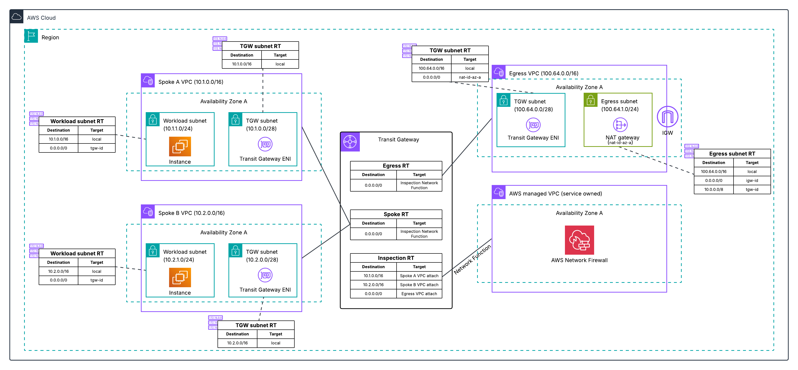

# OPTIMIZING COSTS AND SIMPLIFYING NETWORK ARCHITECTURE WITH "NATIVE ATTACHMENT" IN AWS NETWORK FIREWALL

Determining the placement of a firewall within a multi-VPC cloud architecture to ensure security and architecture-level resilience is a significant design challenge. The solution of using the "Native Attachment" feature of AWS Network Firewall integrated with Transit Gateway thoroughly addresses this issue by optimizing the network topology.

Key points to know:

* The Native Attachment feature allows attaching the AWS Network Firewall directly to the AWS Transit Gateway as a "Network Function".
* Infrastructure automation: AWS automatically deploys the firewall into an AWS Managed VPC, completely eliminating the need to design and maintain a separate "Inspection VPC" and its complex Route Tables.
* Resource cost optimization: Completely cuts the costs associated with maintaining auxiliary resources such as Subnets, NAT Gateways, and intermediate Route Tables.
* Flexible cost allocation: Utilizes Transit Gateway metering policies to accurately calculate and allocate firewall costs to individual projects based on actual generated traffic.
* Simplified traffic flow: Traffic from Spoke VPCs is sent directly to the Transit Gateway, automatically routed through the Network Firewall for malware/intrusion inspection, and then returned for safe routing to the Internet via the Egress VPC.

This architecture is a "best practice" especially useful when an organization prioritizes a Cloud-native approach, aiming to minimize the burden of underlying infrastructure management, optimize operating budgets, and maintain flexible scalability.

### Architecture Diagram

*(Source: AWS Security Blog - Traffic flow structure using Native Attachment. Note: Ensure you place your actual image file in the /images directory)*

### Reference
* Detailed article from the AWS Security Blog: [Why and how to migrate to a Transit Gateway-attached AWS Network Firewall](https://aws.amazon.com/blogs/security/why-and-how-to-migrate-to-a-transit-gateway-attached-aws-network-firewall/)