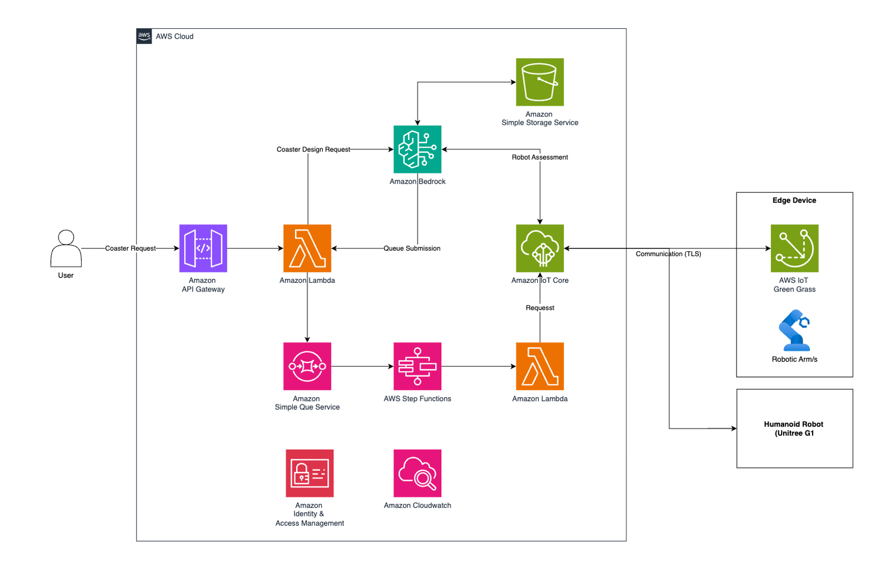

# Flexible Manufacturing with AWS and SoftServe

SoftServe's flexible manufacturing solution heavily leverages the AWS ecosystem to meet the demand for automated product personalization without requiring hardware reconfiguration. Below are the core models and services that drive the success of this system.

Key points to know:

* Prototyping with GenAI (Design): Utilizes Amazon Nova Canvas (via Amazon Bedrock) to automatically generate product designs based on customer text requests.
*Smart Orchestration: Amazon Bedrock Agents act as the "brain," automatically reasoning and making decisions to control robots without hard-coded programming.
* Automated Workflow Processing (Serverless): AWS Lambda automatically processes and converts image file formats; AWS Step Functions and Amazon SQS seamlessly manage machine states and order queues.
* AI Inspection (Vision QA): The Amazon Nova VLM (Vision Language Model) automatically compares photos of the finished product against the original design for quality assurance (Pass/Fail).
* Cloud-to-Edge IoT Connectivity: AWS IoT Core connects the cloud to robots with ultra-low latency; AWS IoT Greengrass processes data at the edge, ensuring continuous operations even during intermittent network connectivity.
*Security and Monitoring: Secures communications using Mutual TLS and monitors all system metrics and real-time robot latency via Amazon CloudWatch.

The combination of AI, Serverless automation, and Edge IoT enables this AWS architecture to achieve nearly 100% efficiency, paving the way for short-run, highly customized production.

### Architecture Diagram

### References
Detailed from the AWS Physical-AI Blog: [Flexible Manufacturing with AWS and SoftServe: How Simulation-First Robotics Reaches Production Faster]
(https://aws.amazon.com/blogs/physical-ai/flexible-manufacturing-with-aws-and-softserve-how-simulation-first-robotics-reaches-production-faster/)