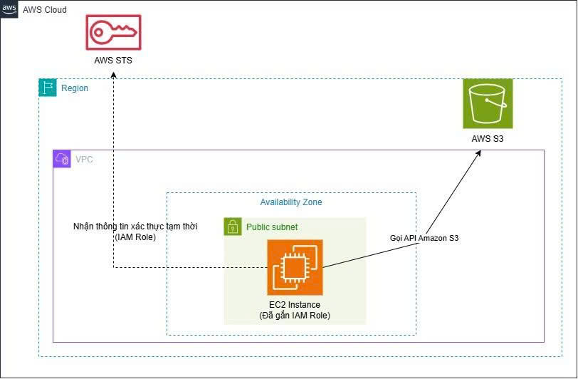

# TÌM HIỂU VÀ TRIỂN KHAI IAM ROLE THAY CHO ACCESS KEY TRÊN EC2
Việc cấu hình trực tiếp Access Key và Secret Access Key (Long-term Credentials) trên máy chủ EC2 thường thấy trong các bài lab học tập vì tính tiện lợi. Tuy nhiên, theo các tiêu chuẩn bảo mật (Best Practices) của AWS, giải pháp an toàn và tối ưu nhất cho môi trường thực tế (Production) là sử dụng IAM Role (Instance Profile) để cấp quyền tự động và an toàn hơn rất nhiều.
Các điểm chính cần nắm:

* Loại bỏ Long-term Credentials: Thay vì lưu thông tin xác thực cố định trên máy chủ (qua lệnh `aws configure`), việc gắn IAM Role vào EC2 giúp ứng dụng lấy được thông tin xác thực tạm thời, giảm thiểu tối đa rủi ro rò rỉ key hoặc mã nguồn.
* AWS STS (Security Token Service): Đóng vai trò tự động cấp phát Temporary Credentials (bao gồm Access Key ID, Secret Access Key và Session Token). Do có thời gian sống (TTL) ngắn và tự động hết hạn, phạm vi ảnh hưởng sẽ được thu hẹp đáng kể nếu thông tin bị lộ.
* Instance Metadata Service v2 (IMDSv2): Đây là kênh giao tiếp để AWS SDK và ứng dụng trên EC2 lấy Temporary Credentials. AWS sẽ tự động quản lý và làm mới (rotate) các chứng chỉ này mà lập trình viên không cần can thiệp.
* Bảo vệ chống tấn công SSRF: IMDSv2 mang lại lớp phòng vệ vững chắc trước lỗ hổng Server-Side Request Forgery bằng cơ chế xác thực hai bước bắt buộc: Gửi HTTP PUT để lấy Session Token, sau đó mới dùng HTTP GET kèm Token trong Header để gọi API.
* Tự động hóa hoàn toàn:** Khi sử dụng IAM Role, các công cụ như AWS SDK và AWS CLI sẽ tự động nhận diện và sử dụng credentials tạm thời, giúp luồng phát triển ứng dụng trơn tru và bảo mật tuyệt đối.
Tính năng này đặc biệt hữu ích khi bạn có nhiều ứng dụng chạy trên cùng một IAM role nhưng cần giới hạn quyền khác nhau (ví dụ: một pod chỉ đọc S3 bucket cụ thể, pod khác chỉ gọi một số API nhất định).

### Sơ đồ kiến trúc

### Nguồn tham khảo
* AWS Security Blog: [Practical steps to minimize key exposure using AWS Security Services](https://aws.amazon.com/vi/blogs/security/practical-steps-to-minimize-key-exposure-using-aws-security-services/)
* AWS Security Blog: [Defense in depth against open firewalls, reverse proxies, and SSRF vulnerabilities with enhancements to the EC2 Instance Metadata Service](https://aws.amazon.com/vi/blogs/security/defense-in-depth-open-firewalls-reverse-proxies-ssrf-vulnerabilities-ec2-instance-metadata-service/)
* AWS IAM User Guide: [Temporary security credentials in IAM (AWS STS)](https://docs.aws.amazon.com/IAM/latest/UserGuide/id_credentials_temp.html)
* AWS IAM User Guide: [Use temporary credentials with AWS resources](https://docs.aws.amazon.com/IAM/latest/UserGuide/id_credentials_temp_use-resources.html)