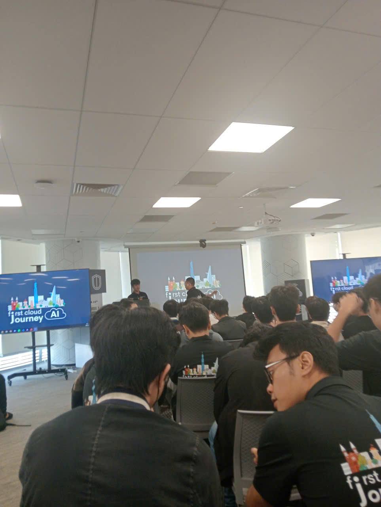

# Summary Report: “AWS First Cloud Journey / Community Day”

### Event Objectives
* Share best practices in modern application design.
* Introduce Domain-Driven Design (DDD) and Event-Driven Architecture.
* Provide guidance on selecting appropriate compute services.
* Showcase AI-powered tools to enhance the development lifecycle.

### Speakers
* **Slavik Dimitrovich** – AWS Representative (Strategic Video Keynote)
* **Nguyen Quoc Bao** – Game Developer / Cloud Builder
* **Bao Huynh** – Junior Cloud Native Developer at Endava / Founder of ITea Lab
* **Viet Phat** – AI/ML Builder
* **Le Hoang Gia Dai** – Security Builder (Team AWS G3)
* **Tran Trung Vinh** – System Administrator at Central Retail Group (Practical Experience Sharing)

---

### Key Highlights

#### 1. Strategic Vision in the AI Era (Video Keynote)
* **Format:** Strategic sharing via pre-recorded video from an AWS expert.
* **Core topics:** Essential skills for builders in the next 5 years, closing the gap between enterprise expectations and builder capabilities, and strategic AI solutions for the ASEAN market.

#### 2. Multiplayer Game Architecture on the Cloud (Nguyen Quoc Bao)
* **Network Choices:** Evaluation of UDP/ENet, WebSocket, and HTTP Polling.
* **Godot Integration:** Practical flow connecting Godot 4 clients to AWS WebSockets, utilizing Lambda for JSON parsing, and DynamoDB for session state management.

#### 3. Containerization Technology (Bao Huynh)
* **Virtualization vs. Containerization:** Comparison of resource efficiency and deployment speed.
* **Live Demonstration:** A hands-on look at containerizing an application and deploying it to a Docker environment.

#### 4. AI/ML & Security (Viet Phat & Le Hoang Gia Dai)
* **GraphRAG:** Leveraging Amazon Bedrock and Amazon Neptune to enhance AI context understanding.
* **NIDS:** Integrating AWS WAF with Machine Learning models to shift from static rules to proactive cyber attack detection.

#### 5. Practical Journey: IT Helpdesk to Senior Sysadmin (Tran Trung Vinh)
* **Operations:** Strategies for handling High Traffic and managing Hardware Failures (the "triage" approach to system resilience).
* **Career:** Practical advice on researching companies via LinkedIn and navigating a career path from IT Helpdesk.

---

### Key Takeaways
* **Design Mindset:** Adopt a "Business-first approach" and leverage a "shared vocabulary" between business and technical teams.
* **Architecture:** Mastery of technical patterns (Pub/Sub, Streaming) and knowing when to use sync vs. async communication.
* **Modernization:** Modernization is not a sprint; it requires a phased approach, clear ROI measurement, and a focus on scalability/resilience.

### Applying to Work
* **Infrastructure:** Standardize dev/deploy environments using Docker.
* **Backend:** Pilot serverless architecture using AWS Lambda and DynamoDB.
* **Career:** Use professional networking (LinkedIn) to research tech stacks and company culture before applying.

---

### Event Experience
The event provided a comprehensive view of Cloud Native and AI applications in practice. 

**Learning from industry experts**
* Experts shared **best practices** in game architecture and containerization.
* The real-world case studies deepened my understanding of **DDD** and **Event-Driven Architecture**.

**Hands-on technical exposure**
* The sessions helped me visualize the **data flow** of real-time systems (Godot to AWS Serverless).
* Learned the **trade-offs** between network architectures, which is critical for system performance.

**Networking and discussions**
* Direct interaction with the builder community helped bridge the gap between my current skills and market requirements.
* Real-world examples reinforced the importance of focusing on business problems rather than just the technology itself.

#### Event Photos

> **Overall:** The event provided not only deep technical knowledge but also reshaped my mindset regarding system design, operational resilience, and cross-team collaboration.