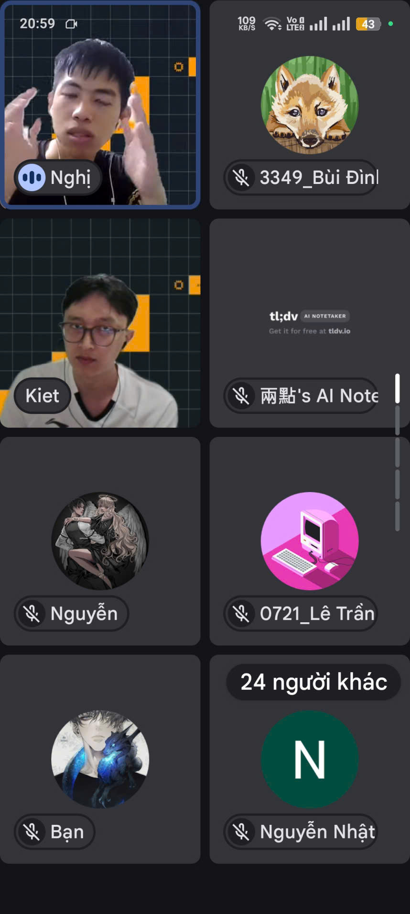

# Summary Report: “AWS Student Builder Group: Build Voice Agents at Scale”

### Event Objectives
* Understand the architecture of AI Voice Agents on the cloud.
* Learn how to utilize Amazon Bedrock AgentCore for generative AI capabilities.
* Explore best practices for deploying and scaling conversational AI applications on AWS.
* Discuss real-world use cases of AI integration in automated workflows.

### Speakers & Host
* **Kiệt Trần** – AI Developer / Guest Speaker
* **Danh Hoàng Hiếu Nghị** – Host / AWS Student Builder Group at HUFLIT

---

### Key Highlights

#### 1. Introduction to Amazon Bedrock AgentCore
* **Capabilities:** How Bedrock AgentCore simplifies the creation of generative AI applications by managing API calls, context windows, and conversation history.
* **Foundation Models:** Selecting the right LLMs for voice-to-text and text-to-voice generation workflows.

#### 2. Designing Voice Agent Architecture
* **Data Flow:** The process of capturing voice input, transcribing, processing intent with LLMs, and synthesizing voice output.
* **Serverless Integration:** Utilizing AWS Lambda and API Gateway to create responsive, low-latency interactions for the voice agent.

#### 3. Scaling and Operational Best Practices
* **Performance:** Strategies for handling high-concurrency requests and optimizing latency in real-time voice processing.
* **Security:** Securing prompts, managing IAM permissions for Bedrock, and ensuring data privacy within the cloud environment.

---

### Key Takeaways
* **AI Mindset:** Shifting from traditional rule-based chatbots to dynamic, context-aware AI agents powered by Foundation Models.
* **Architecture:** Mastering the integration between AI services (Amazon Bedrock) and serverless compute (Lambda) to build highly scalable solutions.
* **Efficiency:** Leveraging managed services allows builders to focus on business logic and agent persona rather than underlying infrastructure.

### Applying to Work
* **AI Integration:** Explore applying Bedrock and generative AI concepts into automated threat analysis or SOC workflows (e.g., using AI agents to summarize security logs and investigate malware behaviors).
* **Serverless Compute:** Standardize the use of AWS Lambda for triggering automated, event-driven tasks.
* **Innovation:** Pilot internal tools utilizing AI agents to speed up information retrieval and system querying within the cloud environment.

---

### Event Experience
The event provided a practical, deep dive into the rapidly growing field of Generative AI on AWS.

**Learning from industry experts**
* The speaker shared **best practices** in building and scaling AI agents, making complex Bedrock concepts easy to digest.
* Real-world demonstrations clarified how foundation models interact with external APIs to execute automated tasks.

**Hands-on technical exposure**
* Visualized the **data flow** of real-time conversational AI systems.
* Gained insights into overcoming latency and state-management challenges in voice-based applications.

**Networking and discussions**
* The Q&A session highlighted common pitfalls developers face when transitioning to generative AI stacks.
* Interacting with the HUFLIT Builder community provided motivation and fresh perspectives on cloud adoption.

#### Event Photos

> **Overall:** The event successfully bridged the gap between theoretical AI concepts and practical cloud engineering, equipping me with the knowledge to start integrating Amazon Bedrock into future operational and security projects.