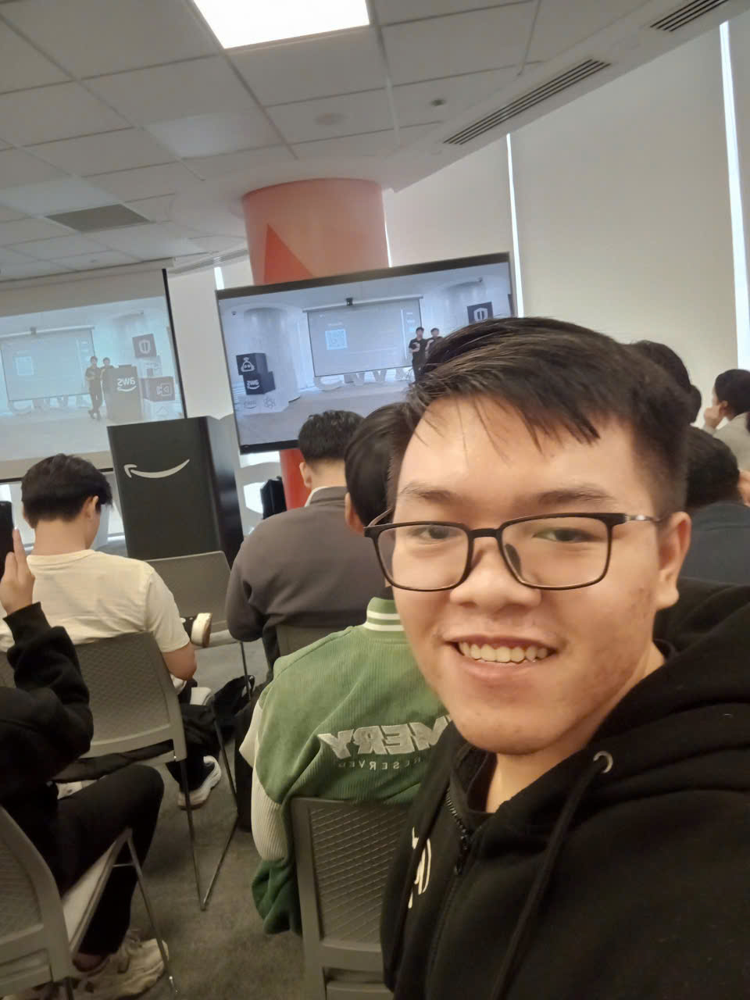

# Event Report: “FCAJ Community Day - Data Driven, AI Risen”

### Event Objectives
* Share digital transformation mindsets and practical experiences in migrating systems from traditional on-premise environments to Cloud platforms.
* Deep dive into modern artificial intelligence solutions: Voice AI, DevOps AI Agents, and AI applications in business administration (HR).
* Guide the architectural design for securely connecting AI with internal enterprise systems via MCP and private networks (VPC).
* Foster networking opportunities among builders, students, and tech experts from AWS and partners.

### Speaker List
* **Steve Tran** (CTO/Founder Cloud Thinker) - Enterprise Mindset & Cloud Journey
* **Nghi Danh** (AI Engineer, Renova Cloud), **Kiet Tran** (AI Engineer, AWS Student Builder Group), **Trung Vu** (CEO, Revve AI) - Voice AI Architecture
* **Bao Phan** & **Nguyen Nguyen** (Cloud Engineers, Cloud Kinetics) - DevOps AI Agent
* **Truong Tran** (AI Solution Sales, Noventiq) & **Minh Anh** (Solution Sales, Noventiq) - AI Applications in HR
* **Toan Nguyen** (AWS Security Builder) - Security & MCP Architecture

---

### Key Highlights

#### 1. Enterprise Mindset and the Cloud Journey (Steve Tran)
* **Real-world context:** The corporate shift from manually maintaining hardware servers to utilizing automated Cloud solutions and tools.
* **Key takeaway:** Students and young builders need early exposure to corporate environments. When executing projects, it is crucial to identify the "Client Champion" (key stakeholder) to align closely with and solve the actual business problems.

#### 2. Voice AI Technology (Nghi Danh, Kiet Tran, Trung Vu)
* **Architecture:** Comparison between the modern Speech-to-Speech AI model and the traditional pipeline (ASR -> LLM -> TTS).
* **Challenges:** Processing Vietnamese (a low-resource language), recognizing regional accents, gender differentiation, and minimizing real-time response latency.
* **Practical Application:** Demo of an automated call center Agent for the banking sector (e.g., VIB, VPBank) featuring tool calling capabilities like automated card locking.

#### 3. DevOps AI Agent (Bao Phan, Nguyen Nguyen)
* **Operational Mechanism:** A 4-step Agent workflow including Triage -> Root cause investigation (forming and proving hypotheses) -> Solution proposal -> Optimization. (The user retains the final decision-making power).
* **Objective:** Significantly reduce Mean Time to Detect (MTTD) and Mean Time to Repair (MTTR) to cut operational costs, particularly for large-scale E-commerce systems.

#### 4. AI in Human Resources Management (Truong Tran, Minh Anh)
* **Solution:** Utilizing Amazon Q combined with OCR technology to automatically scan CVs and cross-reference them with Job Descriptions (JD).
* **Benefits:** Boosts productivity for the recruitment team and automates repetitive administrative tasks, allowing HR to focus on strategic development and talent retention.

#### 5. Security and MCP Connection (Toan Nguyen, Nghi Danh)
* **Security Architecture:** Solving the integration challenge between Amazon Q and enterprise third-party systems (MCP Server).
* **Implementation:** Ensuring that data flows entirely within the internal network (VPC) without being exposed to the public internet, meeting strict enterprise information security standards.

---

### What I Learned

* **Operational Mindset:** AI Agents in DevOps do not replace humans; they change the approach to incident management by using exclusionary hypotheses to shorten downtime (MTTD/MTTR).
* **Network Architecture & Security:** Gained a clear understanding of routing AI traffic through a VPC to ensure data safety—a core skill when integrating LLMs into internal infrastructure.
* **Localization Challenges:** Applying AI technology in Vietnam (Voice AI) requires complex fine-tuning for regional data and resource optimization.

### Application to Work
* Integrate the AI Agent logic into system monitoring automation workflows (SOC/DevOps) to drastically reduce log analysis time.
* Strengthen Cloud security architecture by configuring VPC Endpoints for API connections, ensuring traffic always remains within the private network.
* Research the application of Tool Calling workflows to enhance automation when interacting with data.

---

### Event Experience
The event was highly practical, focusing heavily on how AI is directly resolving business bottlenecks across HR, DevOps, and Customer Service.

**Learning from Industry Experts**
* Observing live practical Demos (Voice AI card locking, Amazon Q CV scanning) helped clearly visualize the current capabilities of Generative AI.
* Insights from Steve Tran helped reshape my career development mindset, emphasizing the core value delivered to customers.

**Technical Experience**
* Deepened my understanding of the security architecture flow when connecting Agents/LLMs with a company's private network infrastructure via VPC.
* Grasped the logical reasoning mechanics (hypothesis generation and validation) utilized by DevOps Agents.

#### Key Takeaways
* Digital transformation is not just about adopting tools; it's about process optimization. AI must solve cost and time challenges (MTTD/MTTR).
* Security must always evolve in tandem with AI development. Precise network design (VPC) is mandatory for handling enterprise data.
* Students and young engineers must diversify their perspectives—excelling not only in technology but also in understanding business operations (Business-first approach).

#### Event Image

> **Summary:** The event systematically redefined the AI technology landscape on the Cloud, providing a solid foundational knowledge of automation, security, and enterprise problem-solving mindsets.