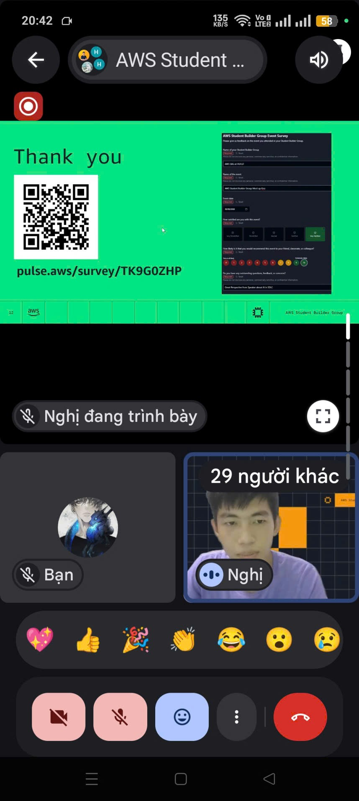

# Event Summary Report: “AWS Student Builder Group - Kiro Spec-Driven Development”

### Event Objectives
* Understand the concept and methodology of Spec-Driven Development.
* Explore the overall role of the Kiro platform in AI-assisted software engineering.
* Discover the workflow of transforming raw Requirements into clear Specifications, System Architecture, and Deployment Plans.
* Improve team collaboration mindsets and make better architectural decisions to effectively leverage AI.

### Speakers & Moderator
* **Quang Tinh Truong** – Main Speaker
* **Kiet Tran** – Guest Speaker
* **Danh Hoang Hieu Nghi** – Moderator (Host) / AWS Student Builder Group at HUFLIT

---

### Key Highlights

#### 1. Introduction to Spec-Driven Development (SDD)
* **Specification-first Mindset:** Shifting from rushing into coding or letting AI generate fragmented code, to focusing on clearly defining structures, constraints, and data flows right from the start.
* **Importance:** Solves the issue of AI "hallucination," helping to generate reliable and maintainable code by providing an overall context.

#### 2. Kiro and AI-Assisted Engineering
* **The Role of Kiro:** Acts as a platform to shape and standardize raw requirements into technical specifications, guiding AI coding assistants to produce code that adheres to architectural standards.
* **The Power of Markdown (.md):** A standout feature is the ability to comprehend, summarize, and automate the creation of system specification files in Markdown format, enabling transparent storage and easy synchronization with the source code.

#### 3. Practical Architectural Deployment (Guest Sharing)
* **AgentCore Runtime Deployment Pattern:** Guest speaker Kiet Tran shared insights on the deployment model for AI Voice Agents, emphasizing the packaging of pipelines into Containers and using MicroVM mechanisms for Session isolation.
* **Network & Security:** Demonstrated the application of TURN servers and NAT Gateway configurations within a VPC to ensure secure, high-speed WebRTC connections.

---

### Key Takeaways
* **System Design Thinking:** AI-generated code is only truly safe and valuable when guided by a standardized architectural design.
* **AI Risk Management:** Business logic should not be entirely handed over to AI. Engineers must hold and control the core system specifications.
* **Deployment Architecture:** Grasped the methodology of system segregation (Container-Session isolation) to securely operate AI models in Cloud environments.

### Application to Work
* **Project Structuring:** Apply the spec-first method to write API documentation, map network communication flows, and establish security modules before writing actual code for the malware detection system.
* **Prompting Optimization:** Require AI to critically review architectures, configure security (WAF, VPC), and output in clear Markdown formats before generating infrastructure configuration files.
* **Infrastructure Utilization:** Apply the Container isolation model and NAT Gateway routing (learned from the Voice Agent pattern) to establish a secure environment for the malicious PE file analysis system.

---

### Event Experience
The online event provided a highly practical perspective on how to control AI in modern programming through a specification-driven approach.

**Approaching the Platform at a High Level**
* Since there were not many deep, complex technical questions, the sharing session on Kiro functioned more as a surface-level introduction, helping the audience easily grasp the core concept and foundational mindset of Spec-Driven Development. However, the short sharing by the guest speaker on the AgentCore deployment model provided highly practical network architecture value.

**Networking Value and Q&A Discussion**
* Despite the small number of questions, the highlight of the Q&A was a very sharp direct comparison: Kiro acts as an architect (focusing on `.md` files and the overall context), whereas tools like GitHub Copilot Pro act more as local coding assistants.

**Changing the Mindset of Working with AI**
* The session eliminated the habit of abusing AI to generate "instant" code. Instead, it encouraged a mindset of transforming requirements into clear system design files, thereby bringing transparency to the software development process.

#### Event Images

> **Overall Assessment:** A practical event that directly addresses modern software development trends. The knowledge of Spec-Driven Development, along with architectural deployment patterns, serves as extremely useful foundational knowledge that I can immediately apply to standardizing documentation and establishing the network topology for my current graduation project.