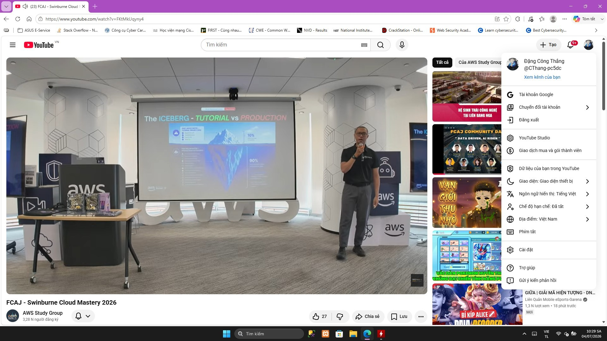

# Event Summary Report: “AWS: Enterprise Cloud Architectures and Industry Applications”

### Event Objectives
* Understand the "Cloud First" strategy within the context of modern enterprise architecture.
* Explore how to design and build Data Engineering systems that meet scalability demands as a business grows.
* Grasp practical requirements regarding career skills, work culture, and how to bridge the gap between academic knowledge and labor market demands.
* Decode the "success formula" and understand why 90% of high-quality job opportunities are not publicly posted.

### Speakers & Event Info
* **Mr. Nguyen Gia Hung** – Head of Solutions Architect in Vietnam & Cambodia, AWS
* **Mr. Vinh Banh** – Senior Data Engineer, Renova Cloud
* **Ms. Nhu Tran** – Account Manager, AWS Vietnam
* **Mr. Khang Nguyen** – Solutions Architect, Cloud Kinetics (Swinburne Alumni)
* **Ms. Quynh Mai** – Moderator (Host)
* **Location:** Level 26, Bitexco Financial Tower / For Swinburne Students & Community

---

### Key Highlights

#### 1. "Cloud First" Trend in Enterprises
* **Core Strategy:** Experts (Mr. Hung) explained why the Cloud is an irreversible trend and the core platform for innovation.
* **Cost Equation:** Although the initial investment for Cloud projects is often much lower than traditional on-premise hardware, the Cloud market is experiencing explosive growth due to its flexibility and pay-as-you-go capability.

#### 2. Data Engineering & Architecture
* **Development Journey:** Expert Vinh Banh shared his practical journey and the stark differences between working at startups versus large corporations (like Heineken or VNG/ZaloPay).
* **Understanding System Fundamentals:** Emphasized the importance of deeply understanding the core system rather than just superficially learning tools to meet the data growth demands of enterprises.

#### 3. Career Skills & Work Culture
* **Work Culture & Mindset:** An impressive "mantra" was introduced: Treat your boss and clients like your "lovers" to build deep understanding and trust.
* **Critical Thinking:** Always asking "Why" to deeply understand the root of the problem (shared by Swinburne alumni Khang Nguyen).
* **Communication & Networking:** Ms. Nhu Tran inspired the audience on how to overcome fear for transparent communication, unlock career development mindsets, and tap into the "hidden job market."

---

### Key Takeaways
* **Importance of Fundamentals:** A solid grasp of network architecture and foundational thinking greatly assists in confidently designing complex systems (like VPCs, NAT Gateways, Load Balancers) rather than just knowing how to use surface-level tools.
* **Data Management:** The mindset of designing scalable data systems as a Data Engineer is a valuable lesson applicable to structuring security log processing or malware analysis data flows.
* **Workplace Survival Skills:** A proactive attitude, the ability to ask the right questions, and the art of managing expectations with managers/clients are vital soft skills for entering the real-world working environment.

### Application to Work
* **Project Architecture Reinforcement:** Reaffirms the correctness of choosing a "Cloud First" strategy when migrating the entire malware analysis system (MalScan AI) to the AWS environment (Fargate, ALB, EFS).
* **Data Flow Optimization:** Applying Data Engineering lessons to optimize the extraction of static features from PE files, ensuring the data pipeline feeding into the Machine Learning model operates as smoothly as corporate standards.
* **Project Communication:** Utilizing the communication "mantra" to proactively report progress to the instructing lecturer and coordinate seamlessly with capstone project team members.

---

### Event Experience
Attending the event in person at the professional space of the Bitexco Financial Tower provided an incredibly realistic experience. The session was highly interactive, with speakers from AWS and their partners (Cloud Kinetics, Renova Cloud) sharing authentic, real-world stories that bridged the gap between university theories and the fierce reality of the IT labor market.

#### Event Images

> **Overall Assessment:** An outstanding seminar that provided a comprehensive view, ranging from the macro perspective (Enterprise Cloud Architecture) to the micro perspective (Engineer survival skills). This serves as an invaluable mindset preparation before stepping into a professional working environment.