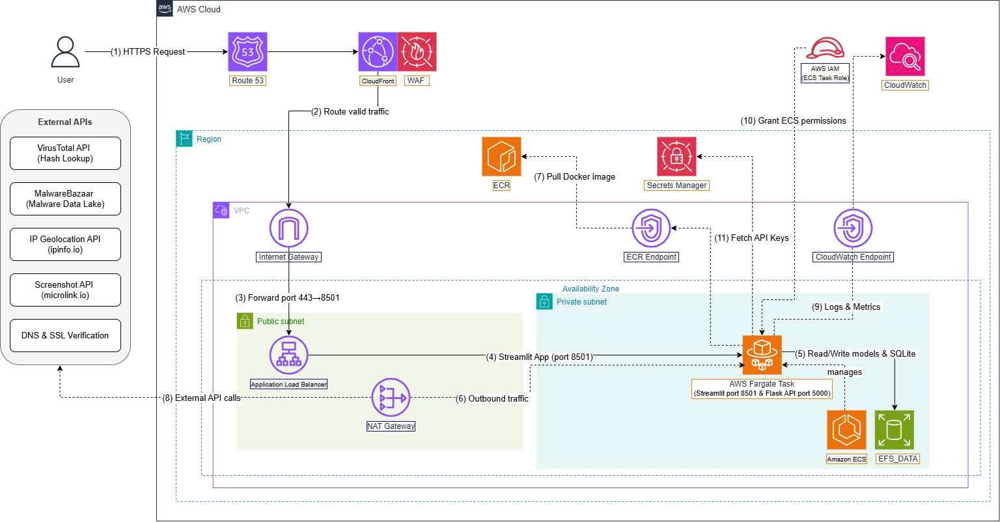

# MalScanAI architecture on AWS

We divided the architecture into the user request path and the supporting connections used by the containers.

#### Main request path

1. The user opens `https://malscanai.sadc.io.vn`.
2. Route 53 resolves the domain to CloudFront.
3. CloudFront receives the HTTPS request, applies the WAF protection layer, and forwards valid traffic to the ALB.
4. The ALB is placed in public subnets and forwards traffic to port `8501` of the ECS task.
5. The Streamlit container calls the URL Engine container through `http://127.0.0.1:5000/api/analyze`.

#### Data and operational connections

- ECS pulls both Docker images from ECR when the task starts.
- The VirusTotal API key is retrieved from Secrets Manager through the task execution role.
- EFS is mounted at `/app/data` so both containers can use the same models, data, and SQLite files.
- Container logs are sent to CloudWatch Logs.
- Requests to external APIs leave the private subnet through the NAT Gateway and Internet Gateway.

{}
The diagram includes ECR and CloudWatch endpoints as a private-connectivity improvement. The screenshots in this workshop follow the environment that our team actually configured, where the private subnet still uses the NAT Gateway for outbound access. For that reason, this workshop does not add separate endpoint creation steps.
{}

The main detail we wanted to protect is the ALB origin. CloudFront adds a custom header, and the ALB listener forwards traffic only when the header matches. A direct request to the ALB DNS name receives a fixed `403` response.
