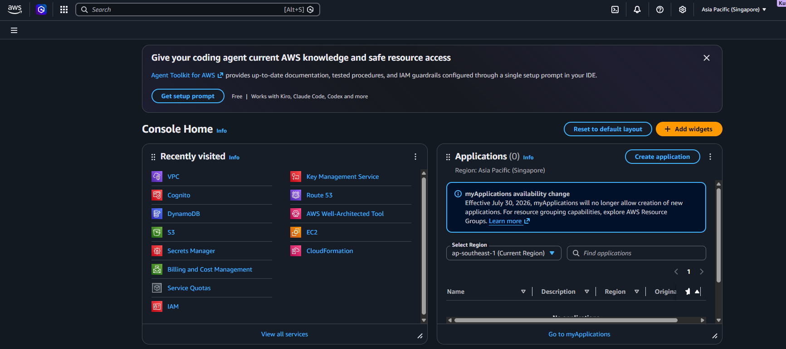

# Chuẩn bị trước khi cấu hình

Trước khi tạo tài nguyên trên AWS, nhóm kiểm tra lại Region, tài khoản đang đăng nhập và hai Docker image của ứng dụng. Việc kiểm tra từ đầu giúp hạn chế trường hợp tạo tài nguyên nhầm Region hoặc push image sang nhầm AWS account.

## 1. Chọn Region triển khai

Trên thanh điều hướng của AWS Console, nhóm chọn Region:

```text
Asia Pacific (Singapore) – ap-southeast-1
```



Nhóm chọn Singapore vì đây là Region gần Việt Nam và các tài nguyên chính của MalScanAI được đặt chung tại đây để dễ quản lý. Riêng chứng chỉ dùng cho CloudFront sẽ được tạo ở `us-east-1` theo yêu cầu của CloudFront.

## 2. Kiểm tra AWS CLI

Trên máy cá nhân, chạy:

```powershell
aws sts get-caller-identity
```

Kết quả dùng để xác nhận AWS CLI đang làm việc với đúng tài khoản. Khi đưa ảnh vào workshop, nhóm che Account ID, User ID và ARN để không công khai thông tin không cần thiết.

## 3. Kiểm tra Docker image

Mã nguồn được chạy thử bằng Docker Compose trước khi đưa lên AWS. Nhóm kiểm tra hai image:

```powershell
docker compose images
```


Hai image cần có trước khi tiếp tục:

- `malscanai-streamlit`: giao diện Streamlit, lắng nghe ở port `8501`.
- `malscanai-url-engine`: Flask API phục vụ phân tích URL, lắng nghe ở port `5000`.

Nếu ứng dụng chưa chạy ổn ở máy local, nhóm sẽ xử lý trước rồi mới push lên ECR. Cách này giúp tách lỗi của mã nguồn khỏi lỗi của hạ tầng AWS.
