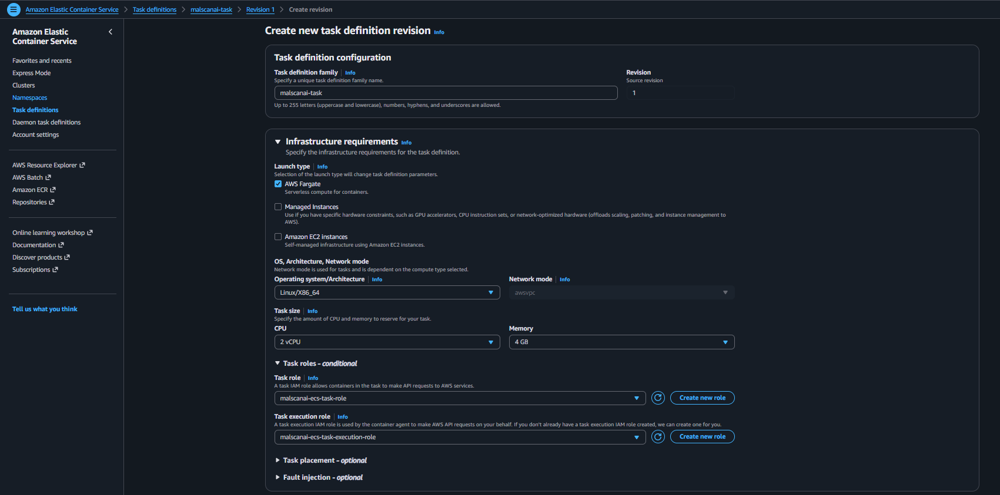
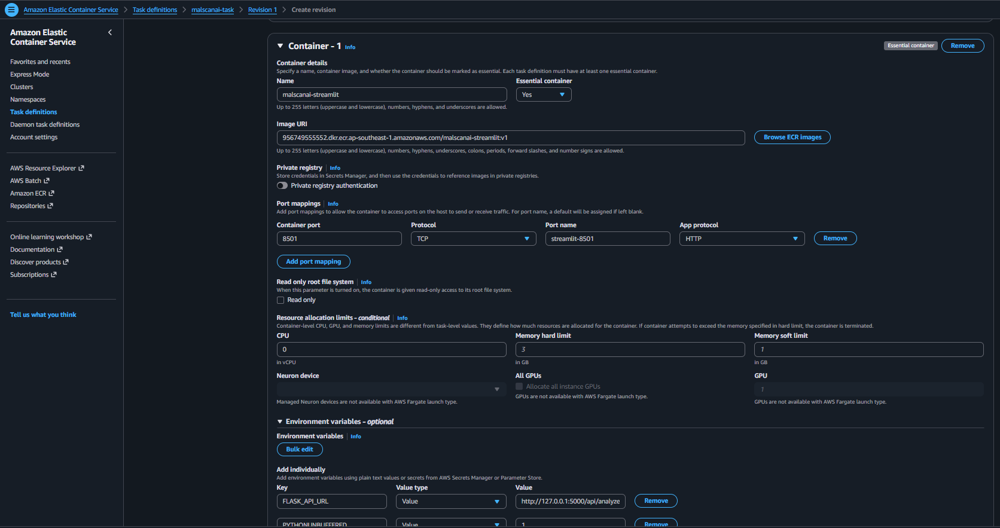
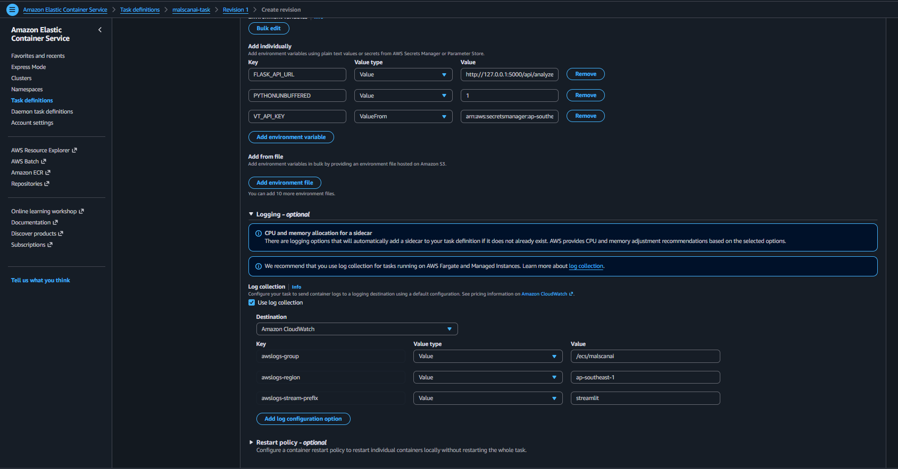
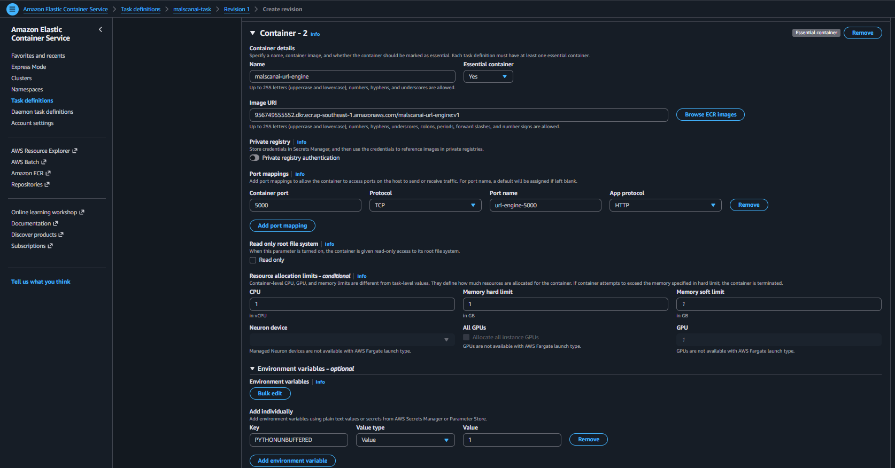
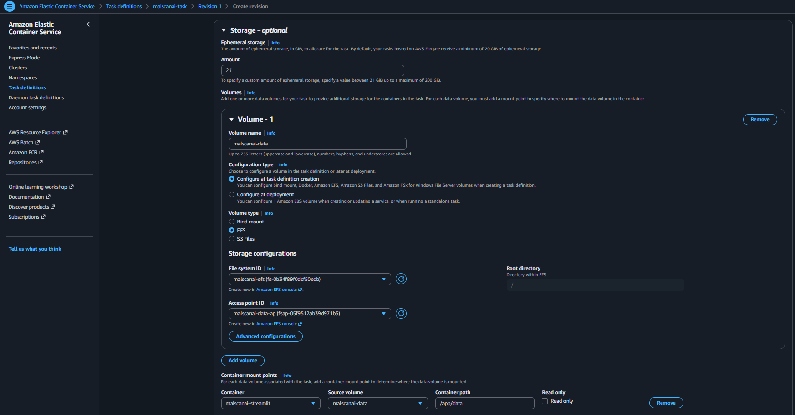
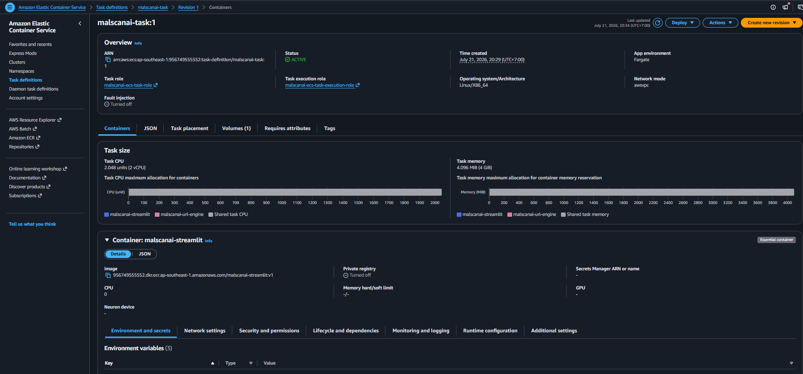

# Khai báo hai container trong một ECS Task

Task Definition mô tả cách ECS chạy Streamlit và URL Engine: image nào được sử dụng, port, CPU, memory, secret, log và EFS volume.

## 1. Cấu hình hạ tầng của task

Tại **Amazon ECS → Task definitions**, chọn **Create new task definition** và nhập:

- **Task definition family:** `malscanai-task`
- **Launch type:** `AWS Fargate`
- **Operating system/Architecture:** `Linux/X86_64`
- **Network mode:** `awsvpc`
- **CPU:** `2 vCPU`
- **Memory:** `4 GB`
- **Task role:** `malscanai-ecs-task-role`
- **Task execution role:** `malscanai-ecs-task-execution-role`



Nhóm dùng `awsvpc` vì đây là network mode của Fargate. Mỗi task nhận một ENI và private IP trong subnet đã chọn ở ECS Service.

## 2. Thêm container Streamlit

Cấu hình container giao diện:

- **Name:** `malscanai-streamlit`
- **Image URI:** image `v1` trong ECR
- **Essential container:** Yes
- **Container port:** `8501`
- **Protocol:** TCP
- **App protocol:** HTTP
- **Memory hard limit:** `3 GB`
- **Memory soft limit:** `1 GB`



Port `8501` được khai báo vì ALB sẽ forward traffic đến Streamlit. Nhóm dành nhiều memory hơn cho container này vì giao diện còn thực hiện xử lý file và đọc model.

## 3. Khai báo biến môi trường, secret và log cho Streamlit

Nhóm thêm:

```text
FLASK_API_URL=http://127.0.0.1:5000/api/analyze
PYTHONUNBUFFERED=1
VT_API_KEY=ValueFrom Secrets Manager
```

Cấu hình log:

```text
awslogs-group=/ecs/malscanai
awslogs-region=ap-southeast-1
awslogs-stream-prefix=streamlit
```



`VT_API_KEY` được lấy bằng ValueFrom nên giá trị thật không nằm trong Task Definition. `PYTHONUNBUFFERED=1` giúp log Python xuất hiện ngay trên CloudWatch.

## 4. Thêm container URL Engine

Cấu hình container backend:

- **Name:** `malscanai-url-engine`
- **Image URI:** image `v1` trong ECR
- **Essential container:** Yes
- **Container port:** `5000`
- **CPU reservation:** khoảng `1 vCPU`
- **Memory hard/soft limit:** khoảng `1 GB`
- **Environment:** `PYTHONUNBUFFERED=1`



Hai container nằm trong cùng task nên Streamlit gọi Flask API bằng `127.0.0.1:5000`. Port `5000` không được đưa vào ALB và không cần mở cho Internet.

## 5. Khai báo EFS volume

Trong phần **Volumes**, thêm volume EFS và chọn:

- File system đã tạo
- Access Point đã tạo
- Transit encryption: Enabled
- Mount path trong container: `/app/data`



EFS giúp model, dữ liệu và SQLite không bị mất khi ECS thay task. Nhóm chỉ mount vào `/app/data`, không mount toàn bộ thư mục ứng dụng để tránh ghi đè mã nguồn trong image.

## 6. Tạo Task Definition

Kiểm tra lại image URI, role, port, secret, log và volume, sau đó chọn **Create**.



Mỗi lần thay image hoặc cấu hình container, nhóm tạo revision mới thay vì sửa trực tiếp revision cũ.
