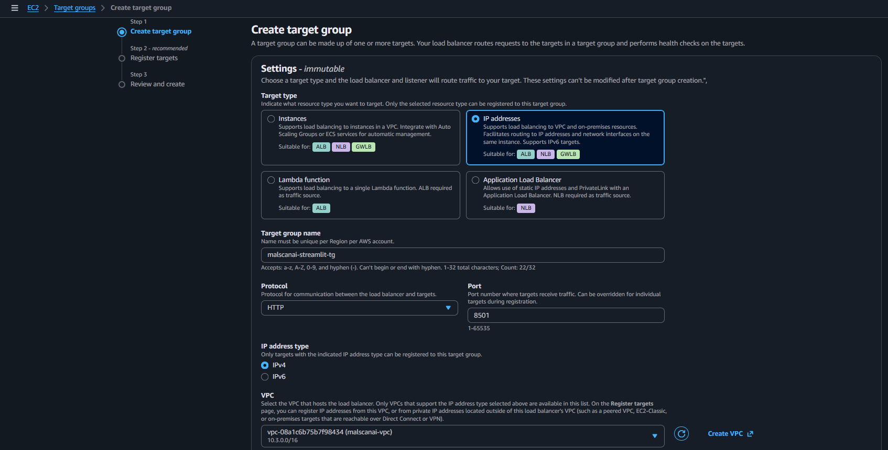
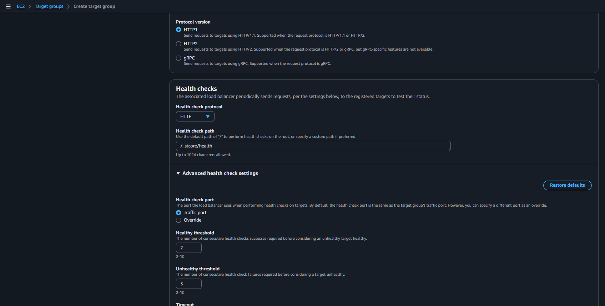
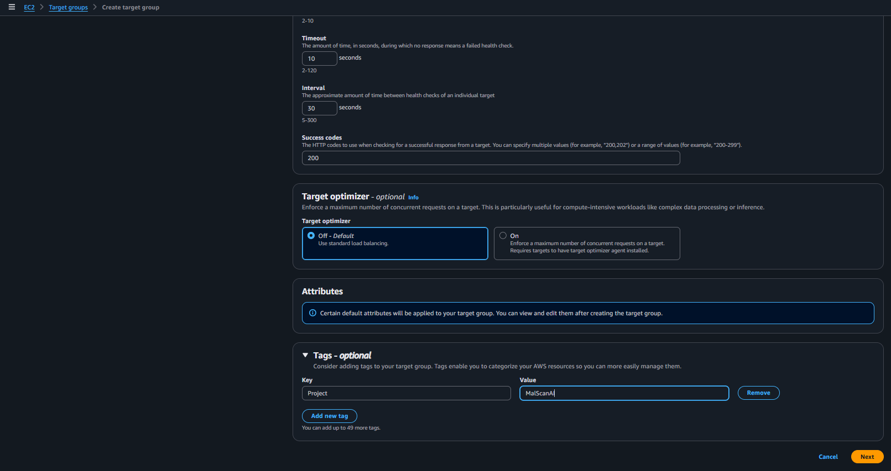
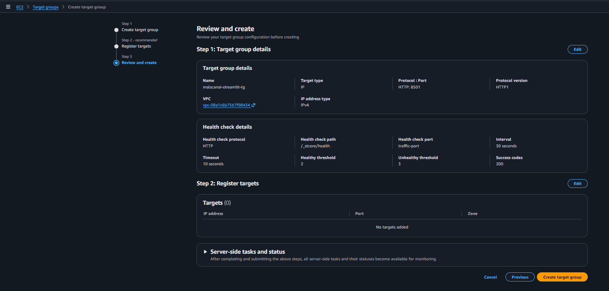
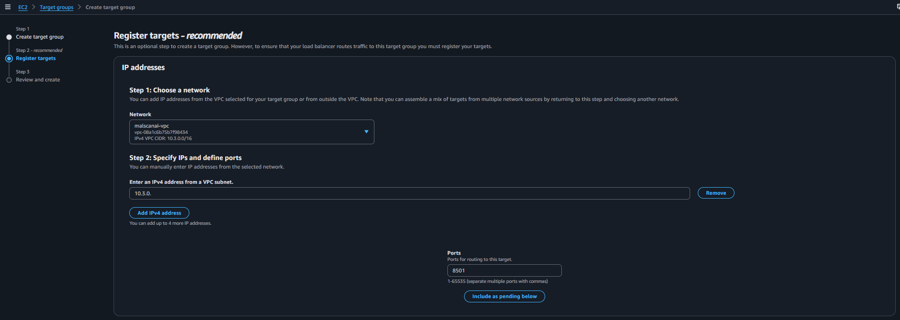

# Tạo Target Group cho Streamlit

Target Group là danh sách đích mà ALB sẽ forward request đến. Với Fargate, ECS tự đăng ký private IP của task vào Target Group.

## 1. Khai báo Target Group

Tại **EC2 → Target Groups**, chọn **Create target group** và cấu hình:

- **Target type:** `IP addresses`
- **Target group name:** `malscanai-streamlit-tg`
- **Protocol:** `HTTP`
- **Port:** `8501`
- **IP address type:** `IPv4`
- **VPC:** `malscanai-vpc`

Nhóm chọn target type là IP vì Fargate dùng `awsvpc`; task không chạy trên EC2 instance do nhóm quản lý. Port `8501` trùng với port của container Streamlit.

## 2. Cấu hình Health Check

Ở phần Health checks, chọn HTTP và sử dụng đường dẫn mà Streamlit có thể trả về mã thành công.

Health check được ALB dùng để xác định task có sẵn sàng nhận request hay không. Nếu container chạy nhưng health check sai path hoặc sai port, target vẫn bị đánh dấu `Unhealthy`.

## 3. Kiểm tra thuộc tính và tạo Target Group

Nhóm giữ các ngưỡng health check gần mặc định trong lần triển khai đầu để dễ theo dõi.

Không đăng ký IP thủ công. ECS Service sẽ thêm và gỡ IP task tự động.

