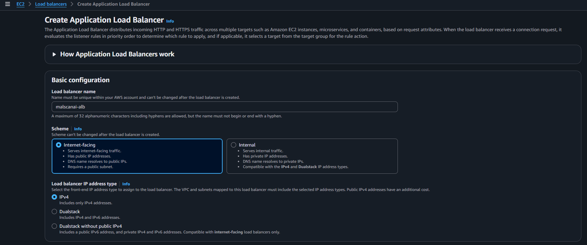
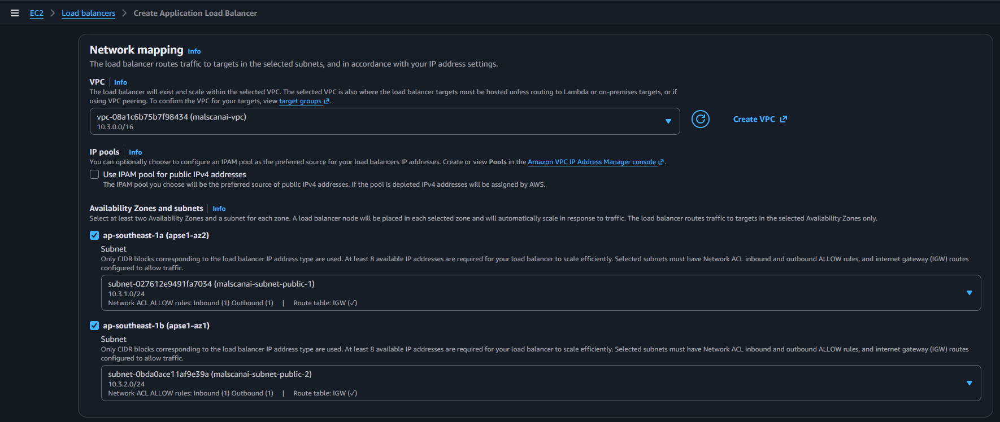
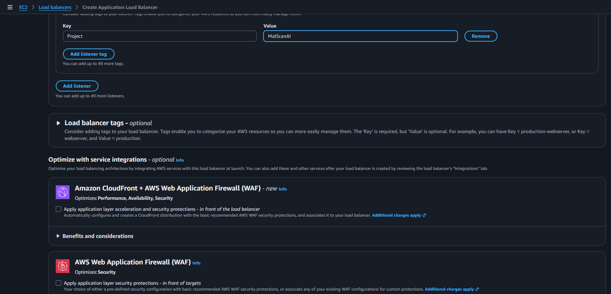
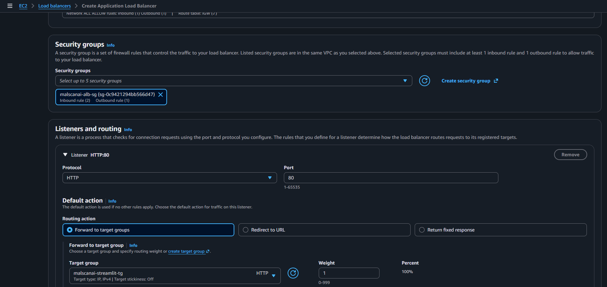
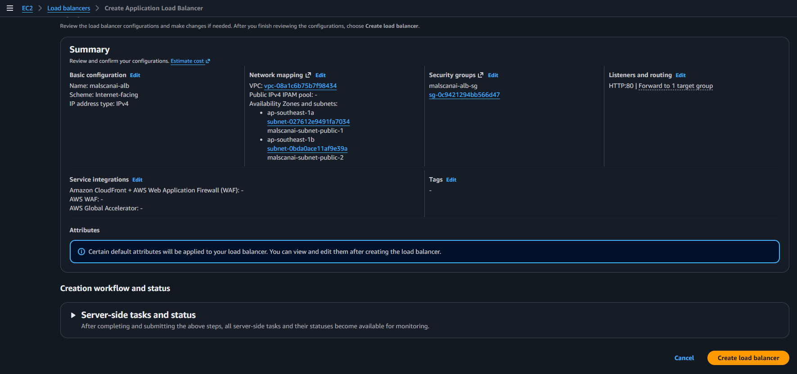
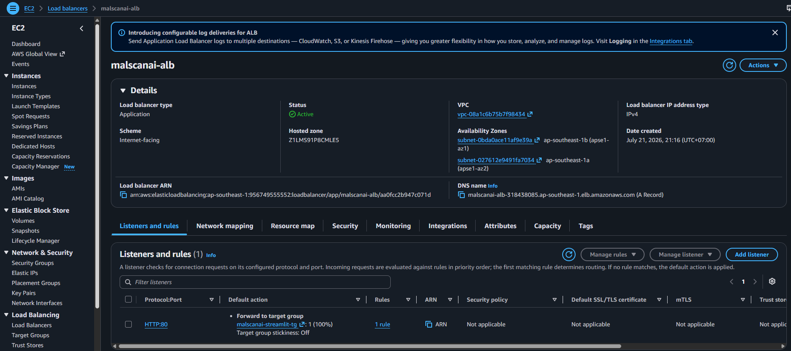
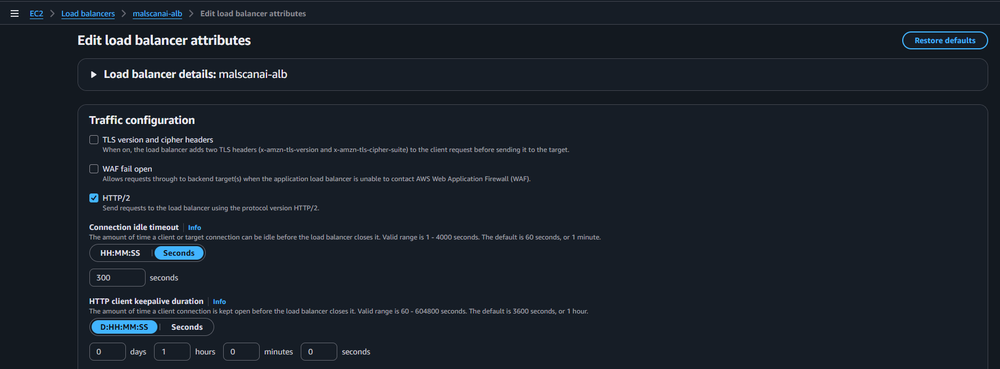

# Tạo Application Load Balancer cho Streamlit

ALB nhận request từ CloudFront và chuyển request hợp lệ đến container Streamlit ở port `8501`.

## 1. Cấu hình thông tin cơ bản

Tại **EC2 → Load Balancers**, chọn **Create load balancer → Application Load Balancer**:

- **Name:** `malscanai-alb`
- **Scheme:** `Internet-facing`
- **IP address type:** `IPv4`



ALB phải là Internet-facing vì CloudFront sử dụng DNS của ALB làm custom origin.

## 2. Chọn VPC và hai public subnet

Ở phần Network mapping:

- **VPC:** `malscanai-vpc`
- **Availability Zones:** `ap-southeast-1a` và `ap-southeast-1b`
- **Subnets:** hai public subnet đã tạo



Hai subnet khác AZ giúp ALB đáp ứng yêu cầu multi-AZ và không phụ thuộc hoàn toàn vào một Availability Zone.

## 3. Chọn Security Group và Listener

Chọn Security Group:

```text
malscanai-alb-sg
```



Tạo listener:

- **Protocol:** HTTP
- **Port:** `80`
- **Default action:** Forward to `malscanai-streamlit-tg`



Kết nối người dùng đến CloudFront sử dụng HTTPS. Trong cấu hình hiện tại, CloudFront kết nối về ALB bằng HTTP trong VPC-facing origin path. Port `5000` của URL Engine không được khai báo ở listener.

## 4. Review và tạo ALB

Kiểm tra subnet, Security Group, listener và Target Group, sau đó chọn **Create load balancer**.



Đợi trạng thái chuyển sang `Active`.



## 5. Kiểm tra thuộc tính ALB

Trong tab **Attributes**, nhóm kiểm tra idle timeout và các thuộc tính kết nối.



Streamlit sử dụng kết nối dài và WebSocket. Nếu giao diện bị ngắt trong lúc xử lý, idle timeout là một trong những thông số nhóm kiểm tra đầu tiên.
