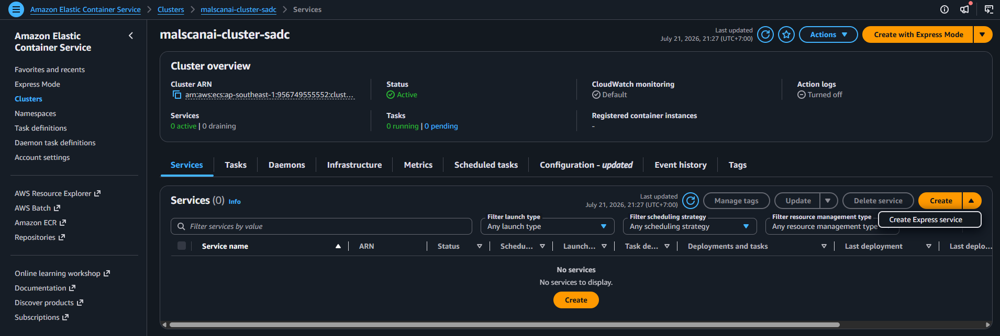
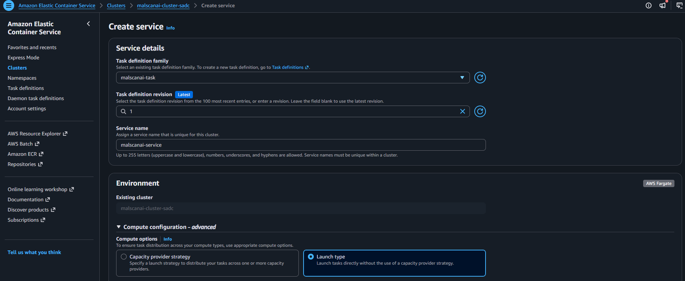
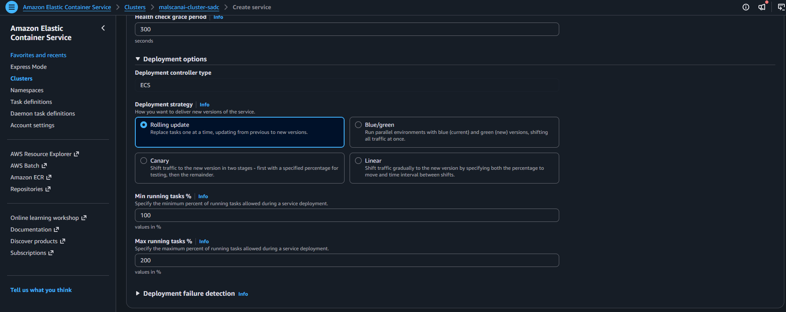
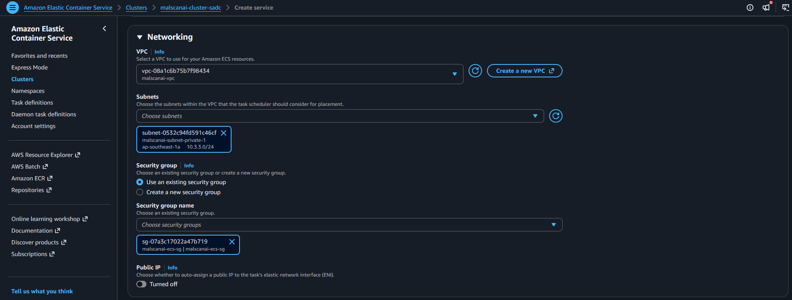
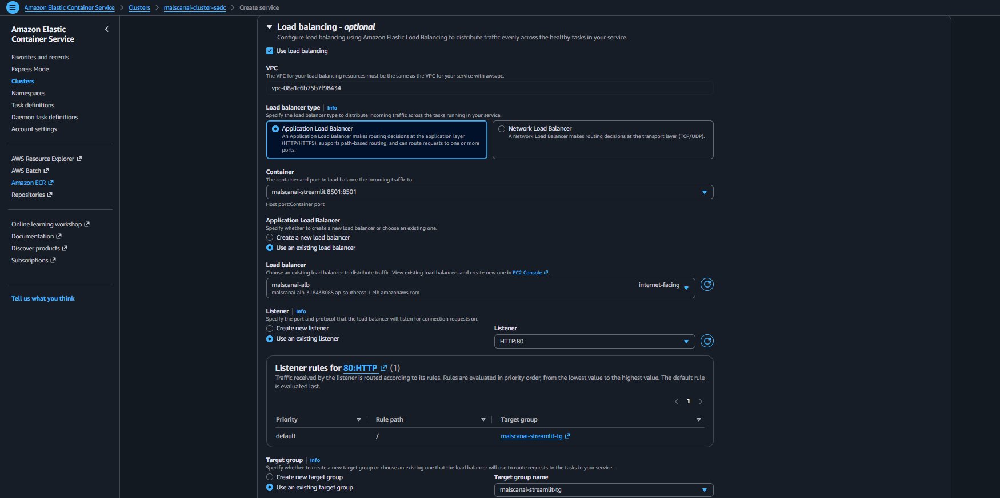
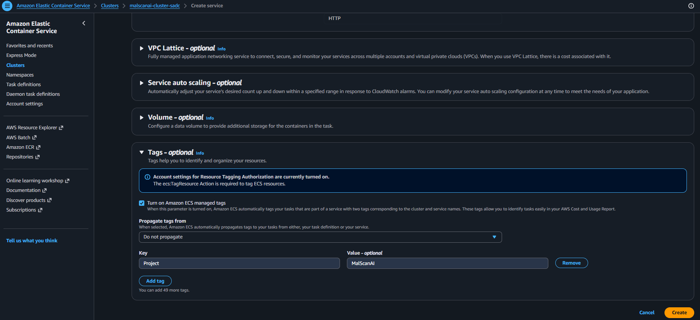
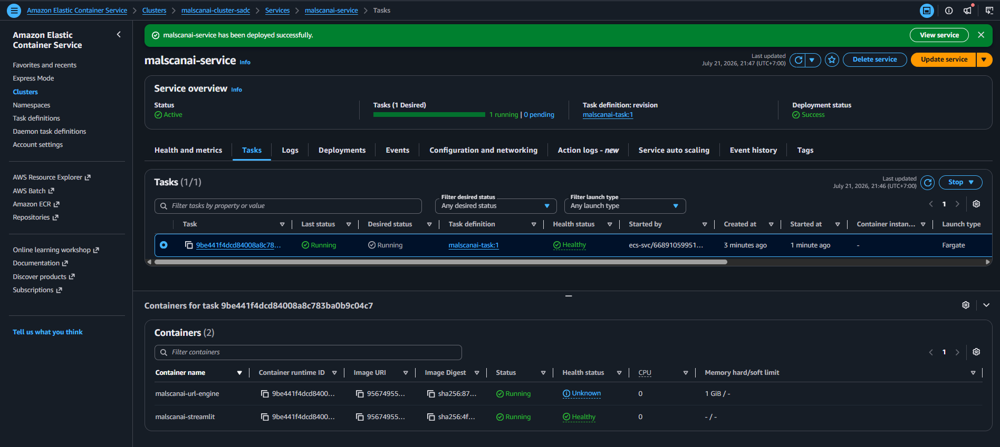
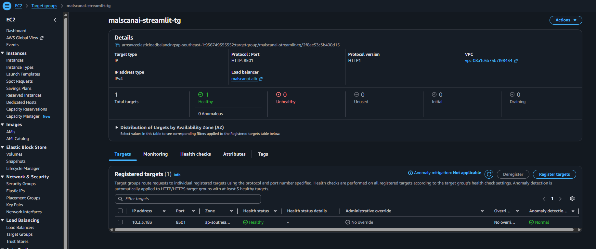

# Run the Task Definition as an ECS Service

The ECS Service maintains the desired number of tasks, replaces failed tasks, and registers tasks with the Target Group.

## 1. Start creating the Service

Open `malscanai-cluster` and choose **Create service**.

## 2. Select the Task Definition and task count

Configure:

- **Compute options:** Launch type
- **Launch type:** `Fargate`
- **Task definition family:** `malscanai-task`
- **Revision:** the latest verified revision
- **Service name:** `malscanai-service`
- **Desired tasks:** `1`

One task is used for the student environment. The ECS Service can still replace the task automatically if it stops.

## 3. Configure deployment

Keep rolling deployment so that, during an update, ECS can start a new task and move traffic before stopping the old task within the configured limits.

## 4. Configure task networking

Select:

- **VPC:** `malscanai-vpc`
- **Subnet:** `malscanai-subnet-private-1`
- **Security Group:** `malscanai-ecs-sg`
- **Public IP:** `Turned off`

The task runs in a private subnet and receives no public IP. Incoming traffic is allowed only from the ALB on port `8501`, while outbound traffic uses the NAT Gateway.

## 5. Attach the ALB and Target Group

Under Load balancing, configure:

- **Load balancer type:** Application Load Balancer
- **Container:** `malscanai-streamlit:8501`
- **Listener:** the `malscanai-alb` listener
- **Target Group:** `malscanai-streamlit-tg`

Only the Streamlit container is registered with the Target Group. The URL Engine remains an internal backend inside the task.

## 6. Review and create the Service

Review the Task Definition revision, subnet, security group, and Target Group, then choose **Create service**.

After a few minutes, the task becomes `Running` and the target becomes `Healthy`.

If the target is `Unhealthy`, the team checks CloudWatch logs, the health check path, port `8501`, the ECS security group inbound rule, and EFS mount errors.
