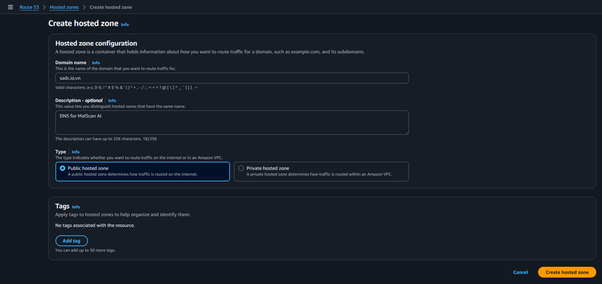
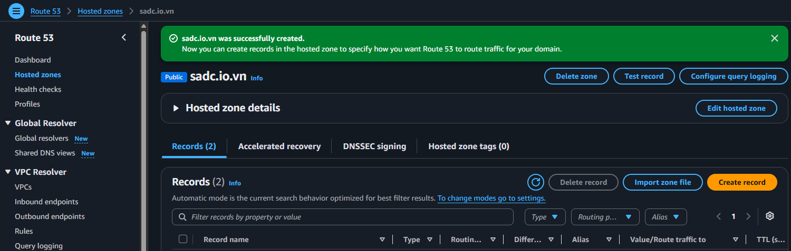

# Quản lý DNS của dự án bằng Route 53

Nhóm sử dụng domain gốc `sadc.io.vn` và dành subdomain `malscanai.sadc.io.vn` cho ứng dụng.

## 1. Tạo Public Hosted Zone

Tại **Route 53 → Hosted zones**, chọn **Create hosted zone** và nhập:

- **Domain name:** `sadc.io.vn`
- **Type:** `Public hosted zone`

Public Hosted Zone được dùng vì tên miền cần phân giải từ Internet. Private Hosted Zone chỉ có tác dụng trong VPC nên không phù hợp cho domain người dùng truy cập.

## 2. Cập nhật Nameserver

Sau khi tạo, Route 53 sinh bản ghi NS và SOA.

Nếu domain được mua ở nhà cung cấp khác, nhóm sao chép bốn nameserver trong bản ghi NS và cập nhật tại trang quản lý domain của nhà cung cấp đó. Việc DNS chuyển hoàn toàn có thể cần thời gian để lan truyền.

Ở bước này nhóm chưa tạo Alias cho `malscanai.sadc.io.vn`. Alias sẽ được tạo sau khi CloudFront Distribution tồn tại để có đúng đích cần trỏ tới.
