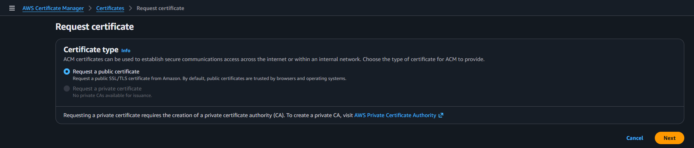
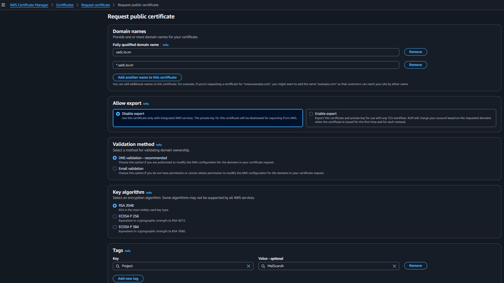
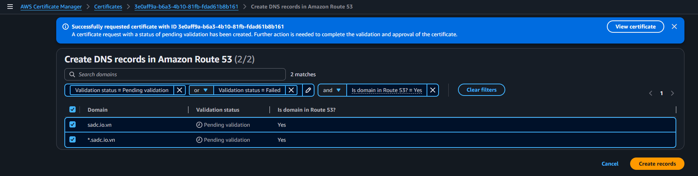
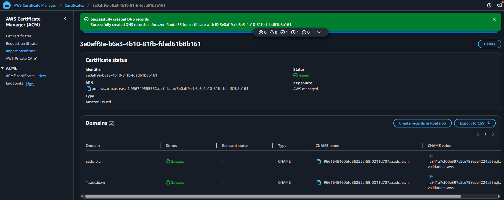

# Tạo chứng chỉ HTTPS cho CloudFront

CloudFront chỉ hiển thị certificate ACM được tạo tại **US East (N. Virginia) – `us-east-1`**. Vì vậy nhóm đổi Region sang `us-east-1` trước khi request certificate.

## 1. Request public certificate

Tại **AWS Certificate Manager**, chọn **Request certificate → Request a public certificate**.



## 2. Khai báo domain và phương thức xác thực

Nhập:

```text
malscanai.sadc.io.vn
```

Chọn:

```text
Validation method: DNS validation
```



Nhóm chọn DNS validation vì domain đang được quản lý bằng Route 53. CNAME xác thực có thể được tạo tự động và ACM tiếp tục tự gia hạn certificate khi record vẫn tồn tại.

## 3. Tạo CNAME validation trong Route 53

Sau khi request, chọn **Create records in Route 53** để ACM thêm CNAME validation vào Hosted Zone.



## 4. Chờ certificate được cấp

Đợi trạng thái chuyển từ `Pending validation` sang `Issued`.



Certificate này sẽ được chọn làm Custom SSL certificate cho CloudFront.

{}
Nếu certificate được tạo ở `ap-southeast-1`, CloudFront sẽ không hiển thị certificate đó. Nhóm cần kiểm tra Region `us-east-1` trước khi request.
{}
