# Place CloudFront and WAF in front of the ALB

CloudFront is the public entry point for MalScanAI. Users connect to CloudFront through HTTPS, and CloudFront forwards valid requests to the ALB.

## 1. Start creating the Distribution

Go to **CloudFront → Distributions** and choose **Create distribution**. If the console displays plan options, select the plan that fits the demonstration and avoid optional paid features that are not required.

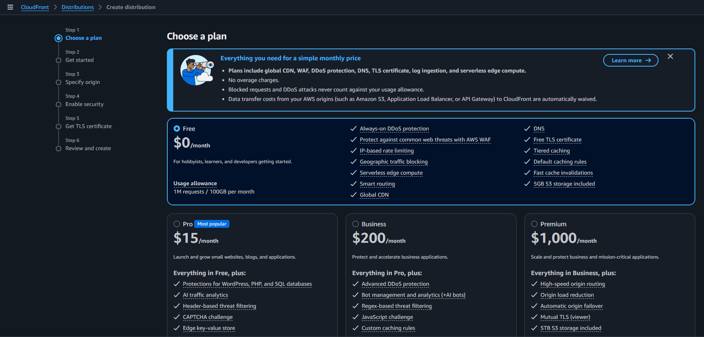

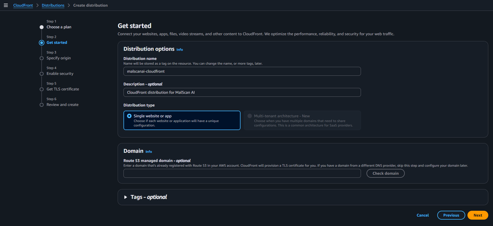

## 2. Select the ALB as the Origin

Under Origin, configure:

- **Origin domain:** the DNS name of `malscanai-alb`
- **Origin type:** Custom origin / ALB
- **Origin protocol:** HTTP in the current setup

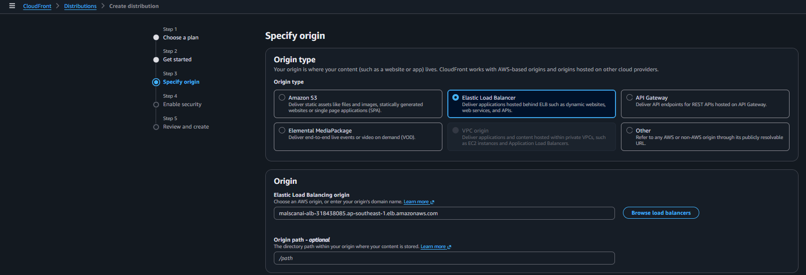

CloudFront does not call the ECS task directly. The ALB continues to perform health checks and sends requests only to healthy targets.

## 3. Configure the Cache Behavior

Streamlit is a dynamic application, so the team does not cache it like a static website. Main settings include:

- **Viewer protocol policy:** Redirect HTTP to HTTPS
- **Allowed methods:** allow the methods required by the application
- Forward the cookies, query strings, and headers required by the Streamlit session

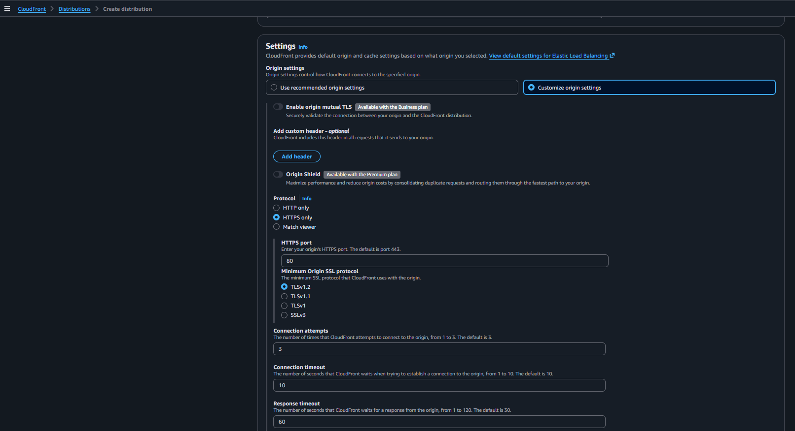

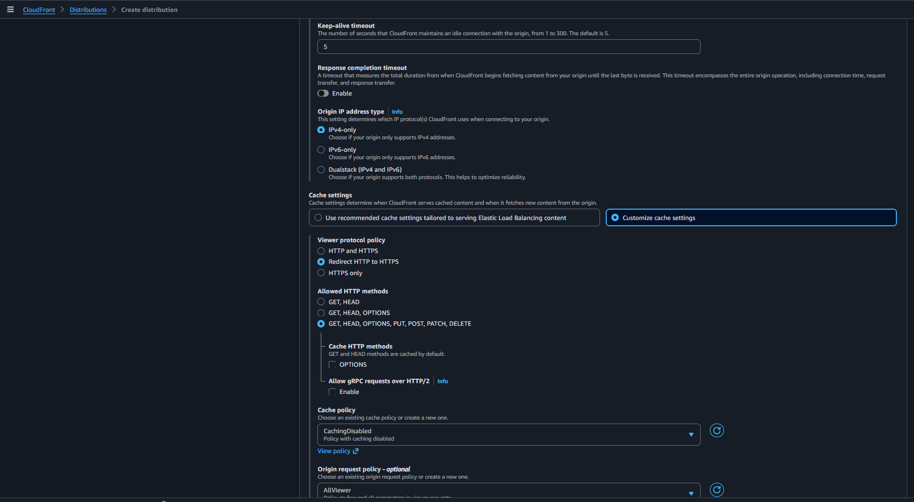

Incorrect caching of HTML or session data can return stale content or disrupt WebSocket connections, so the behavior is configured for a dynamic application.

## 4. Configure WAF

In the protection section, the team keeps the WAF protection included with the selected plan and does not add advanced rules outside the project scope.

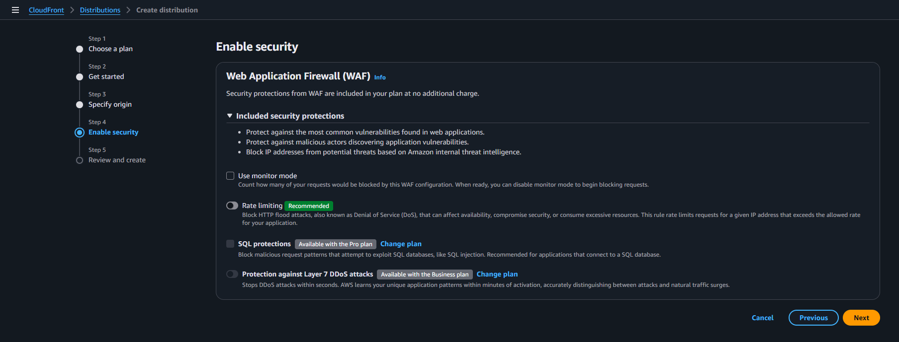

WAF filters requests before they reach the ALB. The next step prevents users from easily bypassing this layer through the ALB DNS name.

## 5. Review and create the Distribution

Review the Origin, behavior, and WAF settings, then choose **Create distribution**.

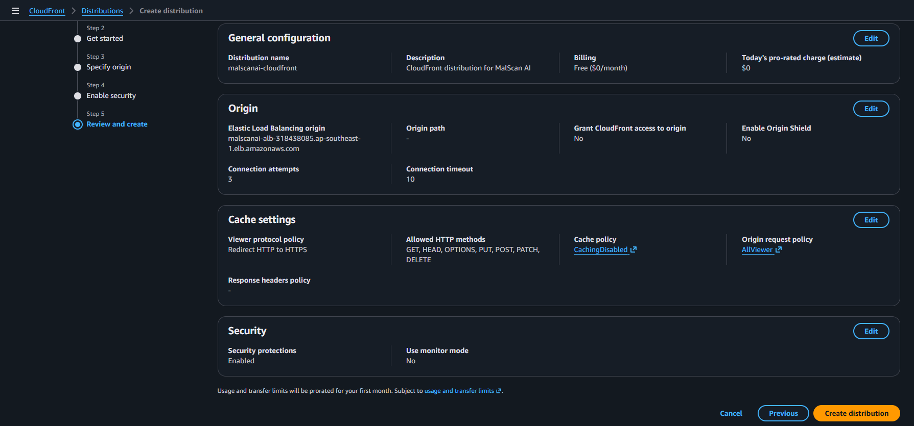

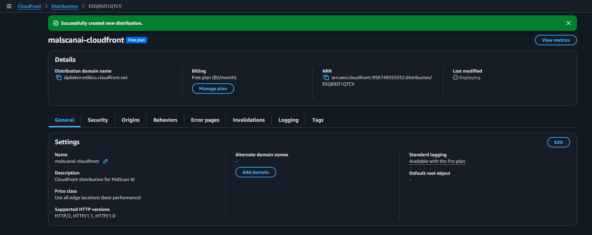

## 6. Attach the domain and certificate

Add the alternate domain name:

```text
malscanai.sadc.io.vn
```

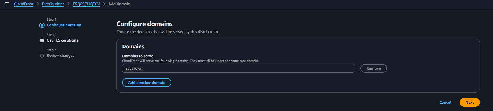

Select the ACM certificate with status `Issued` in `us-east-1`.

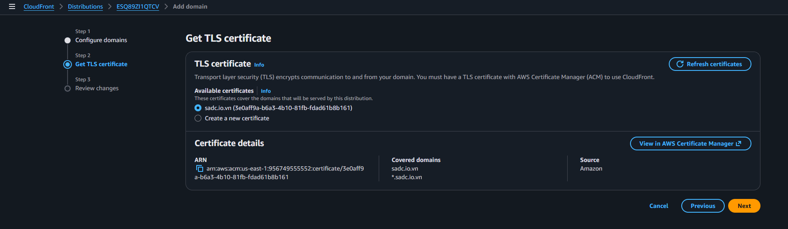

## 7. Create the Route 53 Alias record

After the Distribution becomes `Deployed`, return to Route 53 and create an Alias A record:

```text
Record name: malscanai
Route traffic to: CloudFront Distribution
```

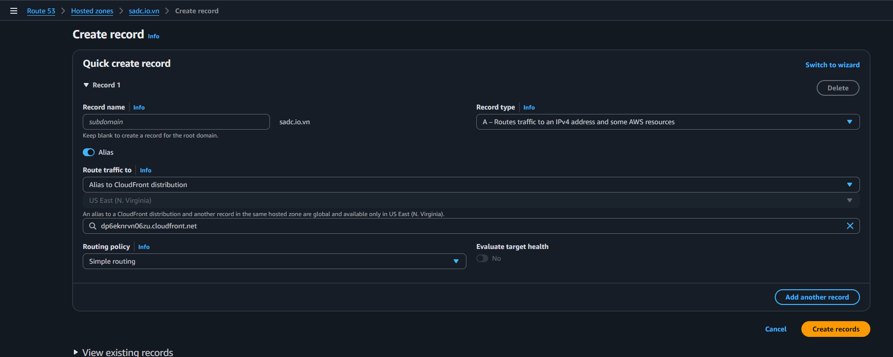

The domain `malscanai.sadc.io.vn` now resolves to CloudFront instead of directly to the ALB.
