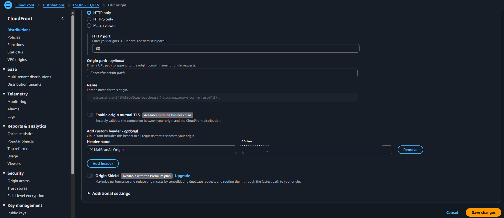
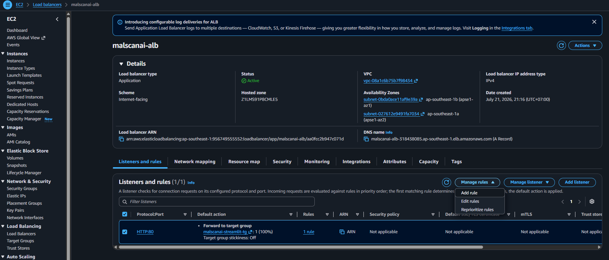
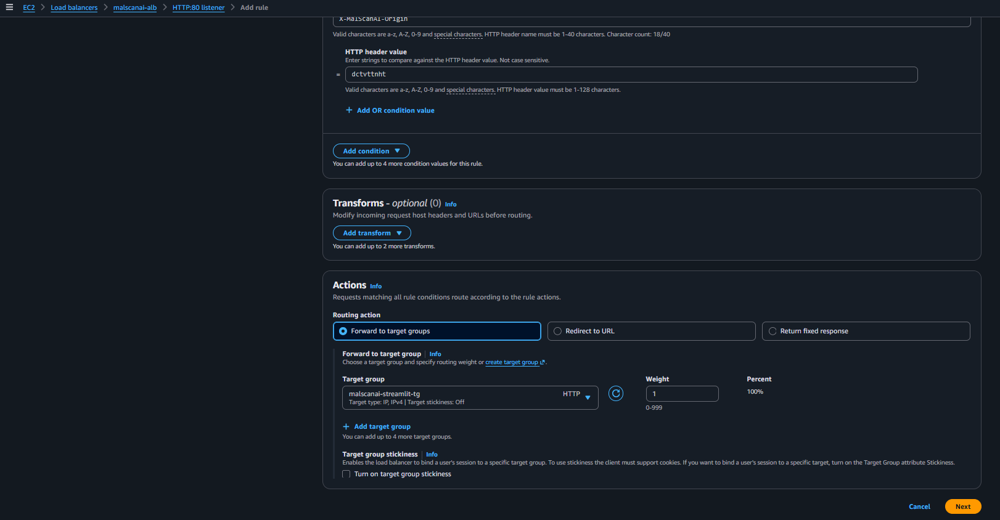
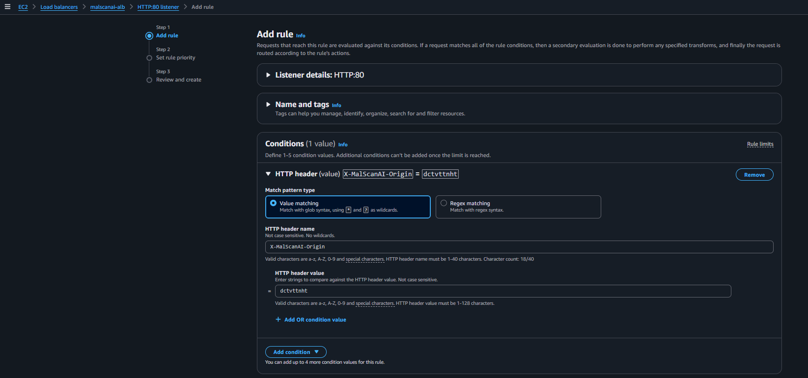
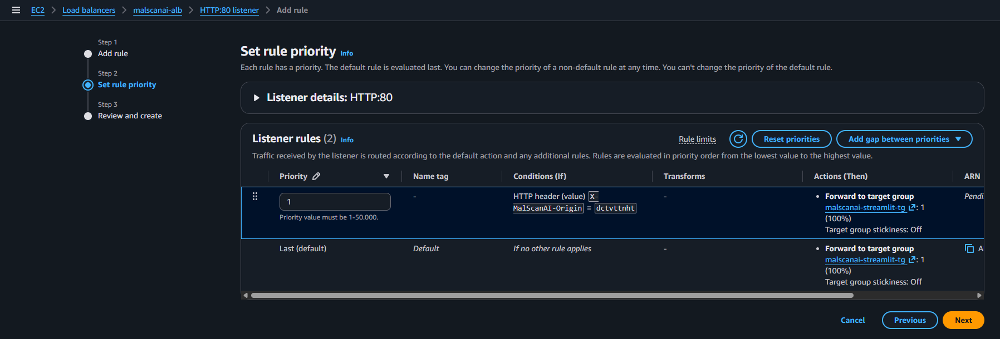
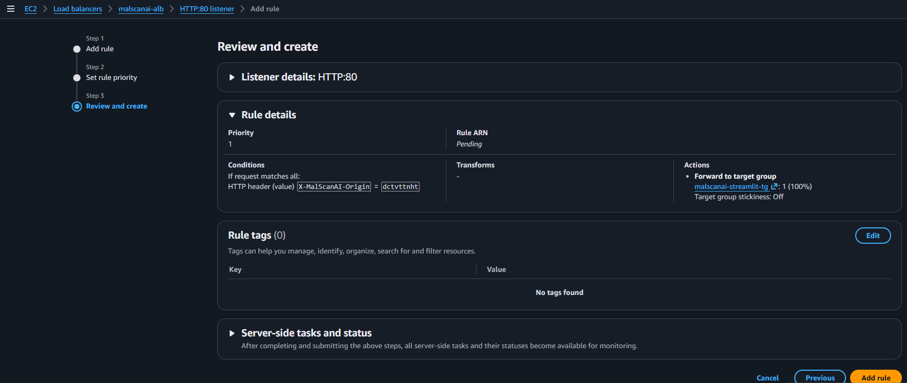
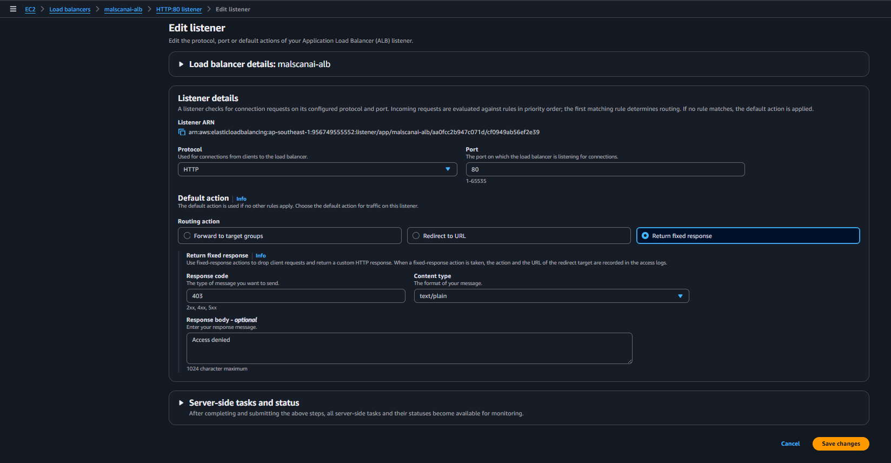

# Chỉ forward request có custom header từ CloudFront

ALB là Internet-facing nên DNS của ALB vẫn có thể bị truy cập trực tiếp. Nếu giữ default rule forward đến Target Group, người dùng có thể bỏ qua CloudFront và WAF. Nhóm dùng custom origin header làm dấu hiệu nhận biết request đến từ CloudFront.

## 1. Thêm Custom Origin Header trong CloudFront

Mở CloudFront Distribution, chọn Origin là ALB và chọn **Edit**. Trong **Add custom header**, nhập:

- **Header name:** `X-MalScanAI-Origin`
- **Value:** chuỗi ngẫu nhiên đủ dài



Giá trị header được xem như secret cấu hình. Nhóm không đưa giá trị thật vào Markdown hoặc ảnh công khai.

## 2. Tạo Listener Rule kiểm tra header

Tại ALB, mở **Listeners and rules → Manage rules**.



Thêm điều kiện:

```text
HTTP header: X-MalScanAI-Origin
Value: <CUSTOM_SECRET_VALUE>
```



Action của rule:

```text
Forward to: malscanai-streamlit-tg
```



Đặt priority cho rule để rule kiểm tra header được xử lý trước default rule.





## 3. Đổi Default Rule thành 403

Sửa default action thành **Return fixed response**:

```text
Status code: 403
Content type: text/plain
Response body: Forbidden
```



Sau cấu hình:

- Request đi qua CloudFront có header đúng → ALB forward đến ECS.
- Request gọi trực tiếp ALB không có header → ALB trả về `403`.

{}
Custom header là lớp hạn chế truy cập trực tiếp phù hợp với mô hình đồ án, nhưng không thay thế xác thực người dùng. Nếu giá trị header bị lộ, nhóm cần đổi giá trị ở cả CloudFront Origin và ALB Listener Rule.
{}
