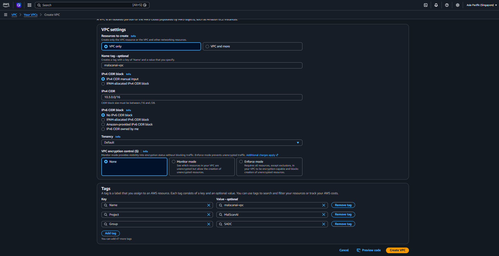
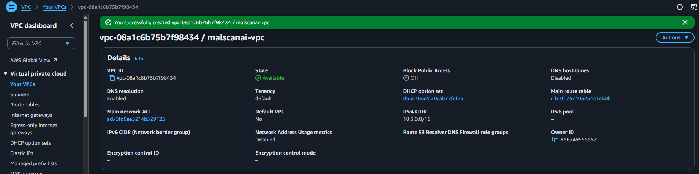
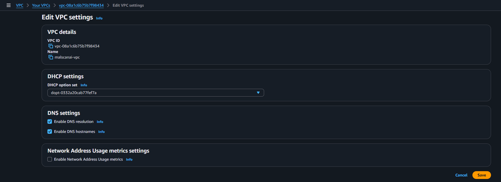
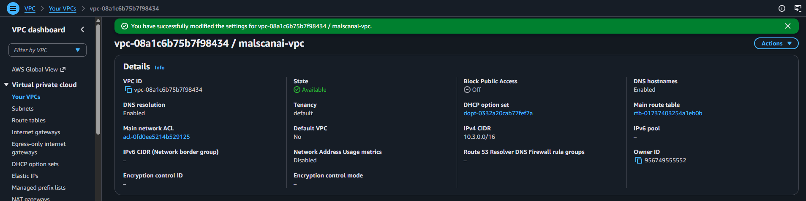

# Tạo VPC riêng cho dự án

## 1. Khai báo VPC

Tại **VPC → Your VPCs**, chọn **Create VPC**, sau đó chọn **VPC only**. Nhóm nhập:

- **Name tag:** `malscanai-vpc`
- **IPv4 CIDR:** `10.3.0.0/16`
- **IPv6 CIDR:** không sử dụng
- **Tenancy:** `Default`

Dải `/16` cung cấp đủ không gian để chia nhiều subnet `/24` mà không phải thay đổi VPC về sau. Nhóm dùng dải private `10.3.0.0/16`, không trùng với mạng đang sử dụng trong phòng lab.

Sau khi kiểm tra thông số, chọn **Create VPC**.

## 2. Bật DNS cho VPC

Từ trang chi tiết VPC, chọn **Actions → Edit VPC settings** và bật:

- **Enable DNS resolution**
- **Enable DNS hostnames**

Chọn **Save changes**, sau đó kiểm tra hai tùy chọn đã ở trạng thái Enabled.

Nhóm bật DNS ngay từ đầu vì ALB, ECS, ECR và các AWS endpoint đều làm việc thông qua tên miền. Nếu tắt DNS, task có thể được tạo nhưng không phân giải được địa chỉ dịch vụ ở các bước sau.
