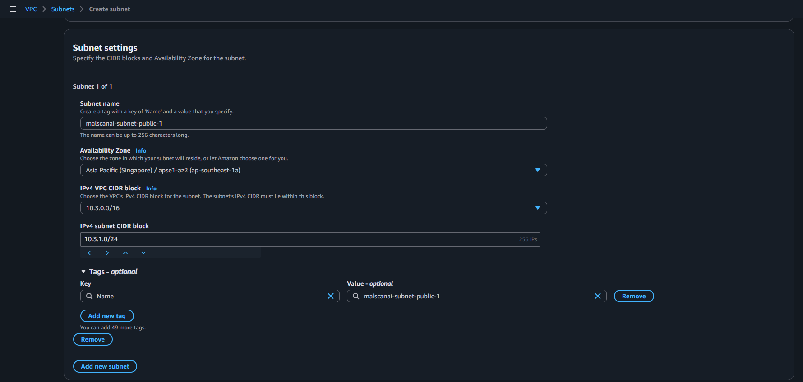
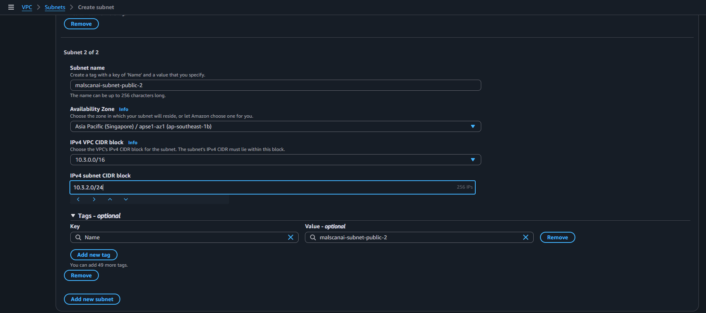
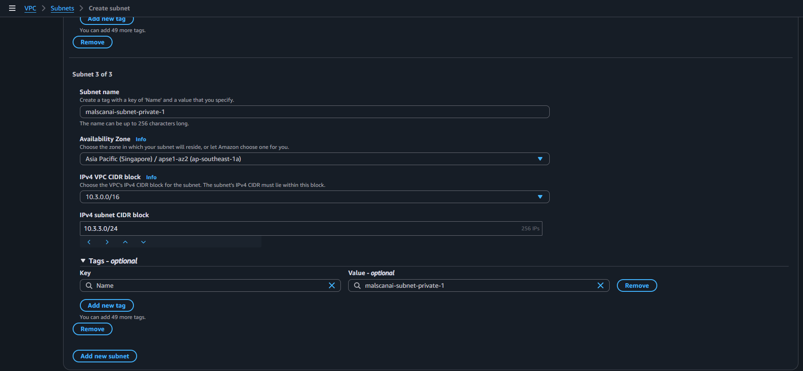
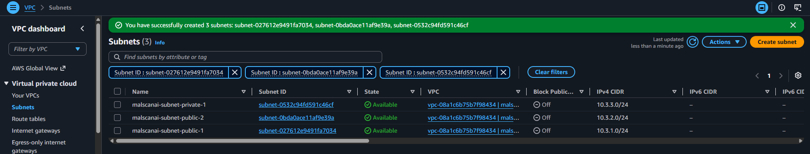
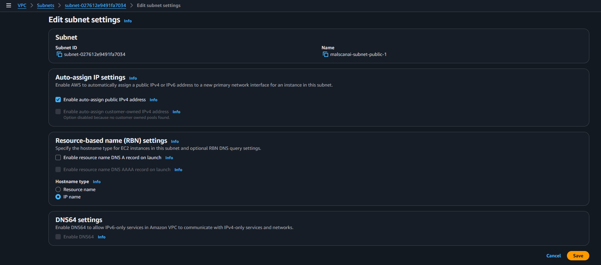
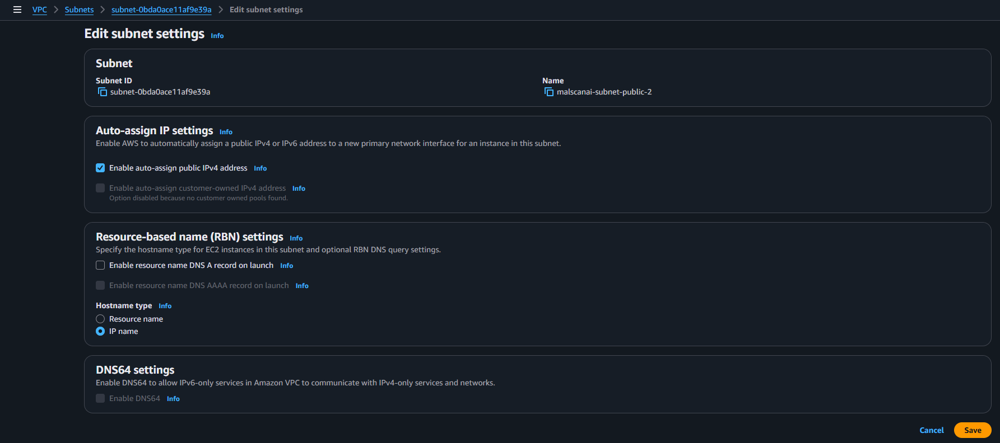

# Chia VPC thành public subnet và private subnet

Tại **VPC → Subnets**, chọn **Create subnet** và chọn VPC `malscanai-vpc`. Nhóm tạo ba subnet trong cùng một lần cấu hình.

## 1. Tạo Public Subnet 1

Nhập các giá trị:

- **Subnet name:** `malscanai-subnet-public-1`
- **Availability Zone:** `ap-southeast-1a`
- **IPv4 VPC CIDR block:** `10.3.0.0/16`
- **IPv4 subnet CIDR block:** `10.3.1.0/24`

Subnet này được dùng cho ALB và có thể đặt NAT Gateway. Dải `10.3.1.0/24` được tách riêng để dễ nhận biết lớp public.

## 2. Tạo Public Subnet 2

Chọn **Add new subnet** và nhập:

- **Subnet name:** `malscanai-subnet-public-2`
- **Availability Zone:** `ap-southeast-1b`
- **IPv4 VPC CIDR block:** `10.3.0.0/16`
- **IPv4 subnet CIDR block:** `10.3.2.0/24`

Public Subnet 2 nằm ở Availability Zone khác Public Subnet 1. ALB yêu cầu tối thiểu hai subnet ở hai AZ khác nhau, vì vậy nhóm không đặt cả hai subnet trong cùng một AZ.

## 3. Tạo Private Subnet 1

Tiếp tục chọn **Add new subnet** và nhập:

- **Subnet name:** `malscanai-subnet-private-1`
- **Availability Zone:** `ap-southeast-1a`
- **IPv4 VPC CIDR block:** `10.3.0.0/16`
- **IPv4 subnet CIDR block:** `10.3.3.0/24`

ECS Fargate task được đặt trong subnet này để không nhận kết nối trực tiếp từ Internet. Task chỉ nhận traffic ứng dụng từ Security Group của ALB.

Sau khi kiểm tra CIDR không bị trùng, chọn **Create subnet**.

## 4. Bật tự động cấp public IPv4

Chọn `malscanai-subnet-public-1`, vào **Actions → Edit subnet settings**, bật **Enable auto-assign public IPv4 address**, rồi lưu lại.

Lặp lại thao tác cho `malscanai-subnet-public-2`.

Không bật tùy chọn này cho private subnet. Việc đặt tên subnet là “public” chưa làm subnet có Internet; subnet chỉ thực sự public sau khi được gắn với route table có đường `0.0.0.0/0` đến Internet Gateway.
