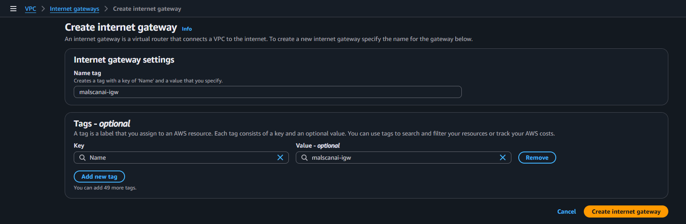
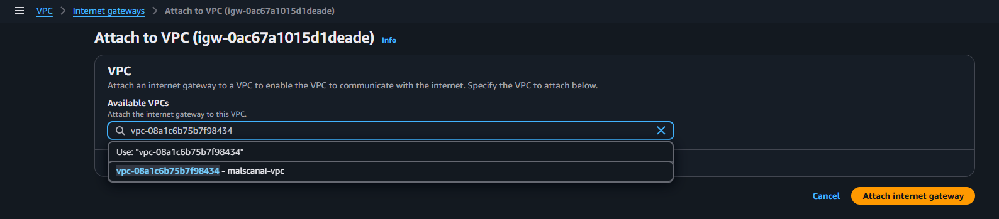
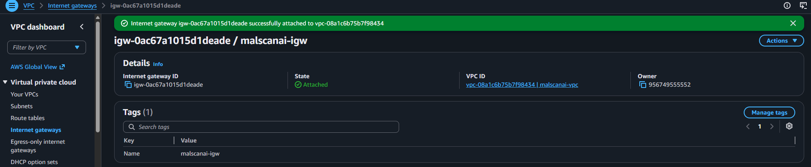
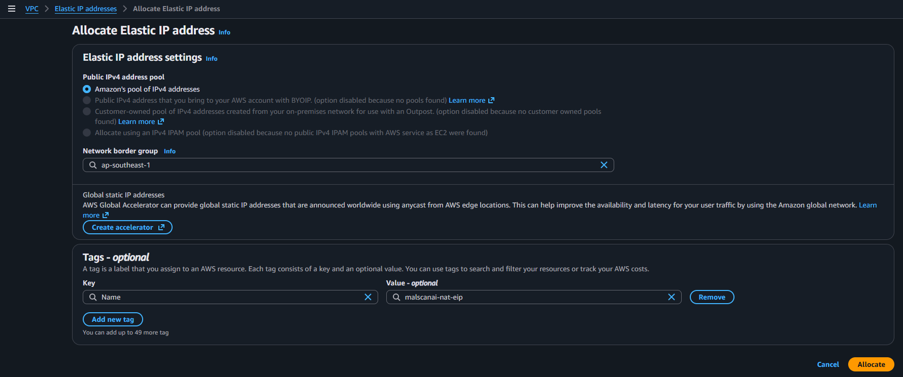
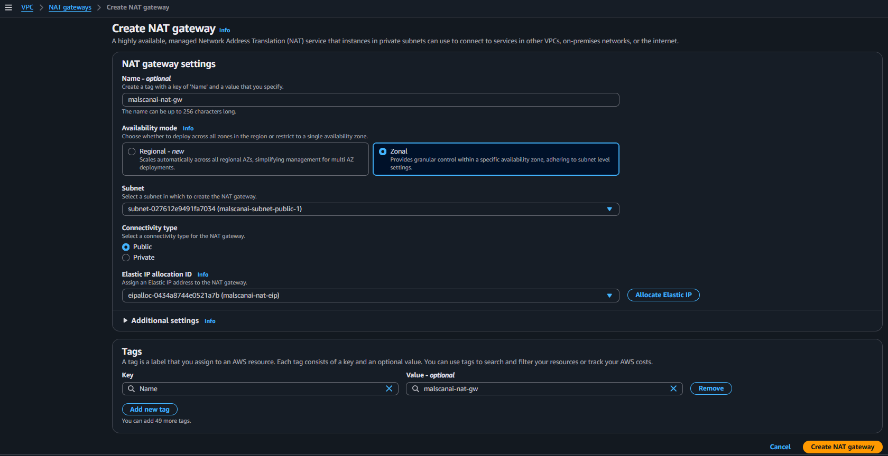
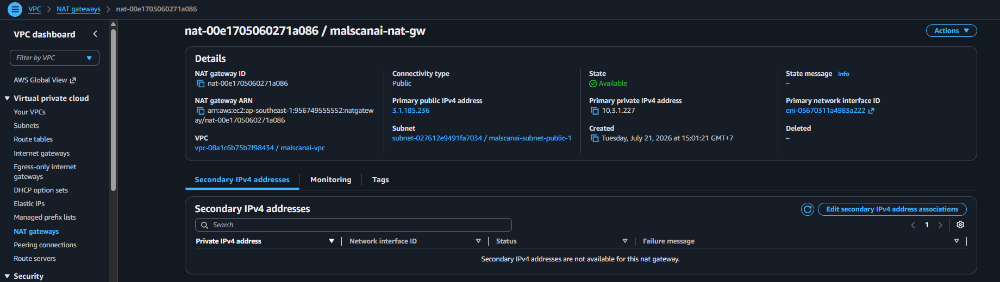

# Tạo đường Internet cho hai lớp mạng

Public subnet cần Internet Gateway để nhận và gửi lưu lượng Internet. Private subnet không đi trực tiếp qua Internet Gateway; nhóm sử dụng NAT Gateway để ECS task chỉ khởi tạo kết nối đi ra ngoài.

## 1. Tạo Internet Gateway

Tại **VPC → Internet gateways**, chọn **Create internet gateway** và đặt:

```text
Name tag: malscanai-igw
```



Sau khi tạo, chọn **Actions → Attach to a VPC**, chọn `malscanai-vpc`, rồi xác nhận.





Internet Gateway chỉ tạo cổng kết nối cho VPC. Public subnet vẫn chưa đi Internet cho đến khi public route table có route đến gateway này.

## 2. Cấp Elastic IP

Tại **Elastic IP addresses**, chọn **Allocate Elastic IP address** và giữ network border group mặc định của Region Singapore.



Elastic IP được gắn vào NAT Gateway để địa chỉ public của NAT không thay đổi trong thời gian sử dụng.

## 3. Tạo NAT Gateway

Tại **NAT gateways**, chọn **Create NAT gateway** và cấu hình:

- **Name:** `malscanai-nat-gateway`
- **Subnet:** một public subnet, nhóm sử dụng Public Subnet 1
- **Connectivity type:** `Public`
- **Elastic IP allocation ID:** Elastic IP vừa cấp



Chọn **Create NAT gateway** và đợi trạng thái chuyển sang `Available`.



ECS task cần NAT Gateway để pull image, gửi log và gọi VirusTotal, MalwareBazaar, ipinfo.io hoặc microlink.io khi không dùng đủ VPC Endpoint. NAT Gateway không cho Internet chủ động mở kết nối vào private task.

{}
NAT Gateway tính phí theo giờ và dung lượng dữ liệu. Khi kết thúc buổi demo, nhóm xóa NAT Gateway và giải phóng Elastic IP nếu không còn sử dụng.
{}
