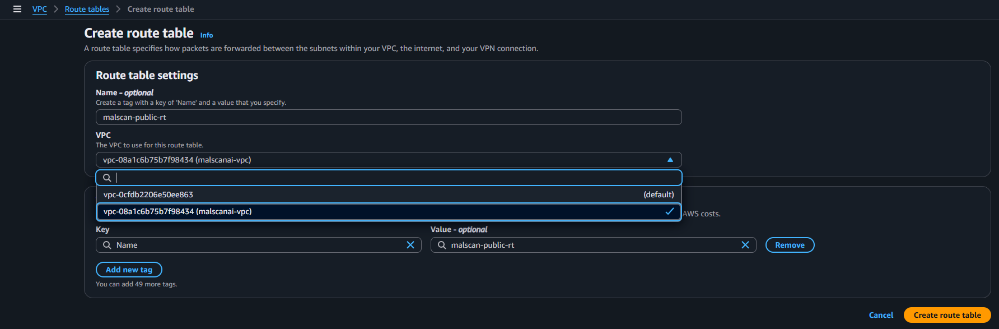
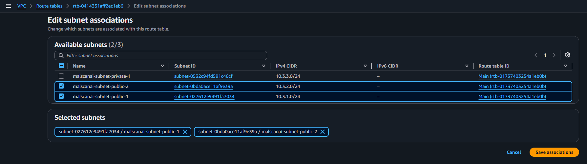
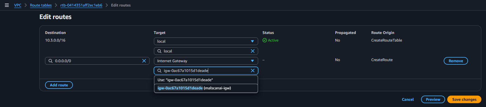
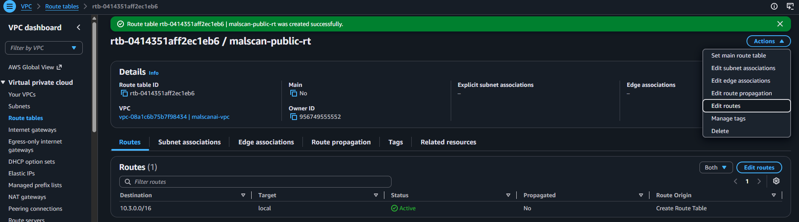
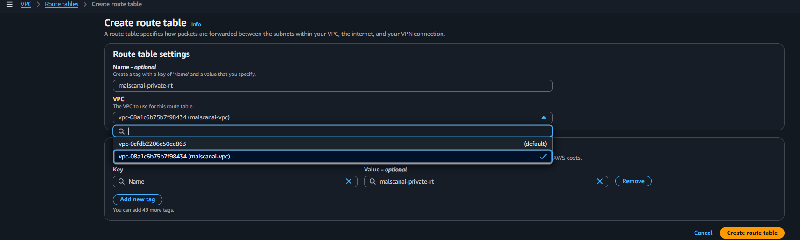
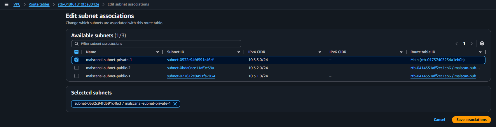
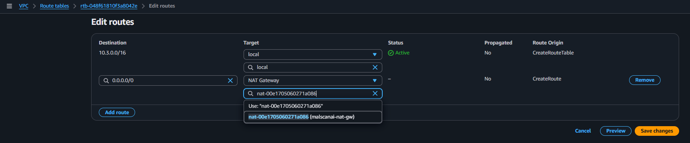
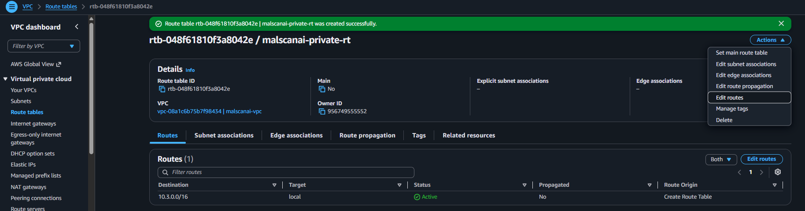

# Separate public and private traffic with route tables

The team created two route tables. The public route table sends traffic to the Internet Gateway, while the private route table sends outbound traffic to the NAT Gateway.

## 1. Create the Public Route Table

Go to **VPC → Route tables**, choose **Create route table**, and configure:

- **Name:** `malscan-public-rt`
- **VPC:** `malscanai-vpc`



Open **Subnet associations → Edit subnet associations** and select:

- `malscanai-subnet-public-1`
- `malscanai-subnet-public-2`



In the **Routes** tab, choose **Edit routes → Add route**:

```text
Destination: 0.0.0.0/0
Target: Internet Gateway – malscanai-igw
```





This route gives both public subnets a direct path to the Internet Gateway, which is required by the public ALB and NAT Gateway.

## 2. Create the Private Route Table

Create a second route table:

- **Name:** `malscan-private-rt`
- **VPC:** `malscanai-vpc`



Under **Subnet associations**, select only `malscanai-subnet-private-1`.



Add the default route:

```text
Destination: 0.0.0.0/0
Target: NAT Gateway – malscanai-nat-gateway
```





The ECS task can now initiate outbound connections from the private subnet, but there is no direct Internet route into the task. User traffic follows CloudFront → ALB → ECS.
