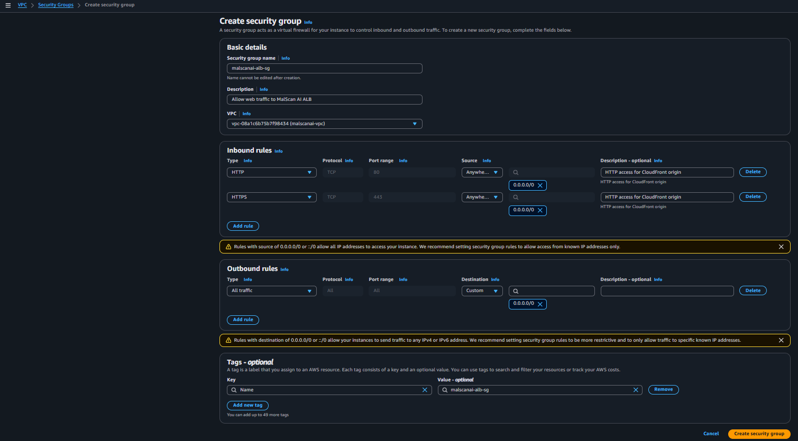
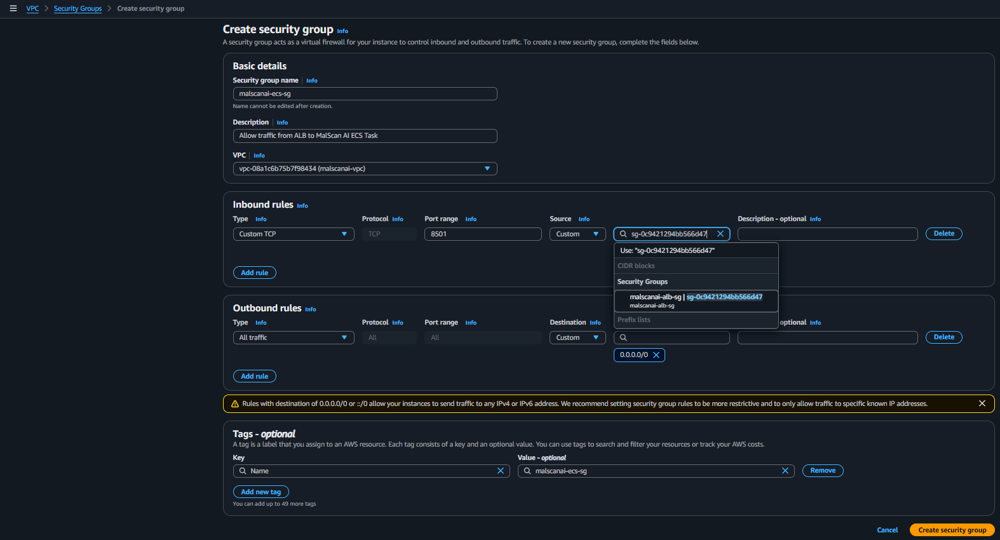
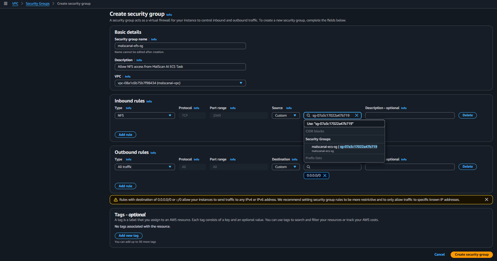

# Use a separate security group for each layer

The team created separate security groups for the ALB, ECS, and EFS. This makes the allowed traffic path clear and avoids using one overly permissive security group for the whole system.

## 1. ALB security group

Go to **VPC → Security groups**, choose **Create security group**, and configure:

- **Name:** `malscanai-alb-sg`
- **VPC:** `malscanai-vpc`
- **Inbound HTTP 80:** source `0.0.0.0/0`
- **Inbound HTTPS 443:** source `0.0.0.0/0`
- **Outbound:** keep the default rule

The ALB is a public CloudFront origin and must accept Internet connections. In the final configuration step, a custom header and listener rule are added so that direct requests to the ALB receive `403`.

## 2. ECS security group

Create the second security group:

- **Name:** `malscanai-ecs-sg`
- **Inbound type:** Custom TCP
- **Port:** `8501`
- **Source:** `malscanai-alb-sg`
- **Outbound:** allow outbound connections

Port `8501` accepts traffic from the ALB security group instead of `0.0.0.0/0`. The rule remains valid even when the task private IP changes. Port `5000` is not opened because Streamlit reaches the URL Engine through `127.0.0.1` inside the same task.

## 3. EFS security group

Create the third security group:

- **Name:** `malscanai-efs-sg`
- **Inbound type:** NFS
- **Port:** `2049`
- **Source:** `malscanai-ecs-sg`

EFS accepts NFS only from the ECS task. Port `2049` is not opened to the full VPC or to the Internet because only the MalScanAI containers need to mount the file system.
