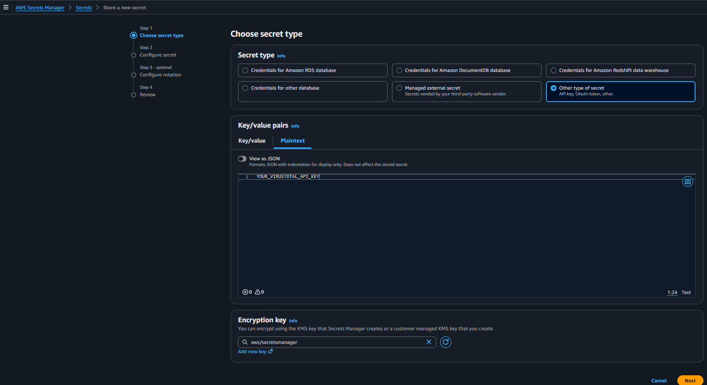
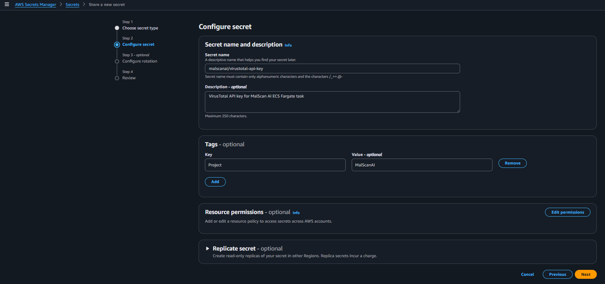
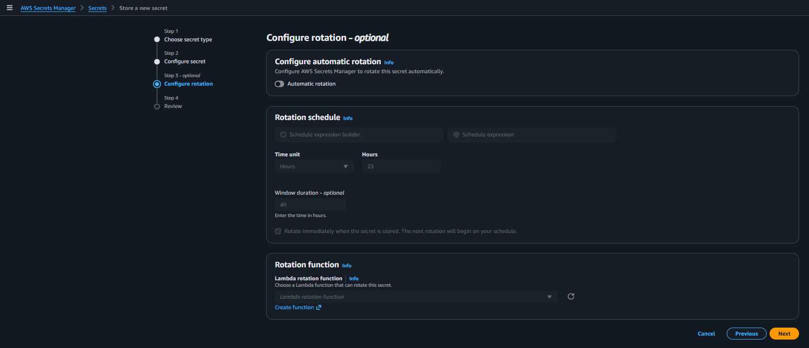
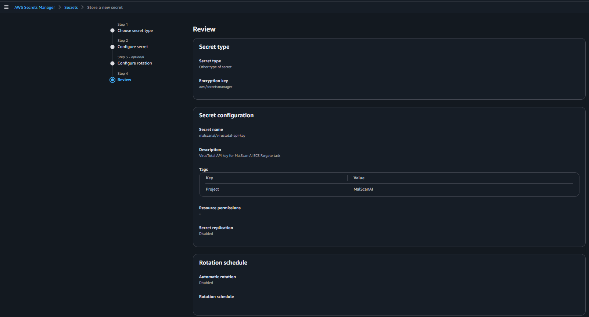
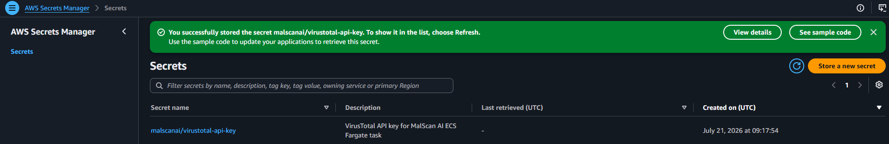

# Lưu API key trong AWS Secrets Manager

MalScanAI sử dụng VirusTotal API để tra cứu hash. Nhóm không ghi API key vào source code, Dockerfile hoặc biến môi trường trong image vì các vị trí này dễ bị lộ khi chia sẻ mã nguồn hoặc kiểm tra image.

## 1. Chọn loại secret

Tại **AWS Secrets Manager**, chọn **Store a new secret** và cấu hình:

- **Secret type:** `Other type of secret`
- **Secret value:** nhập dưới dạng Plaintext hoặc key/value
- **Encryption key:** `aws/secretsmanager`



Trong ảnh workshop chỉ dùng placeholder. API key thật không được hiển thị.

## 2. Đặt tên secret

Nhóm đặt tên:

```text
malscanai/virustotal-api-key
```



Tên có tiền tố `malscanai/` giúp phân nhóm secret theo dự án và dễ giới hạn IAM policy vào đúng tài nguyên.

## 3. Chọn cách thay đổi key

Nhóm không bật automatic rotation.



VirusTotal là dịch vụ bên ngoài AWS và không tự đổi API key thông qua Secrets Manager. Khi cần thay key, nhóm cập nhật một version mới của secret rồi triển khai lại ECS task.

## 4. Kiểm tra và lưu secret

Kiểm tra lại tên, encryption key và rotation, sau đó chọn **Store**.





ARN của secret được dùng ở IAM policy và Task Definition. Khi công khai workshop, nhóm che Account ID và phần định danh không cần thiết trong ARN.

{}
Nếu API key thật từng xuất hiện trong ảnh, commit hoặc log, cần thu hồi key cũ và tạo key mới. Chỉ che ảnh sau khi key đã lộ là chưa đủ.
{}
