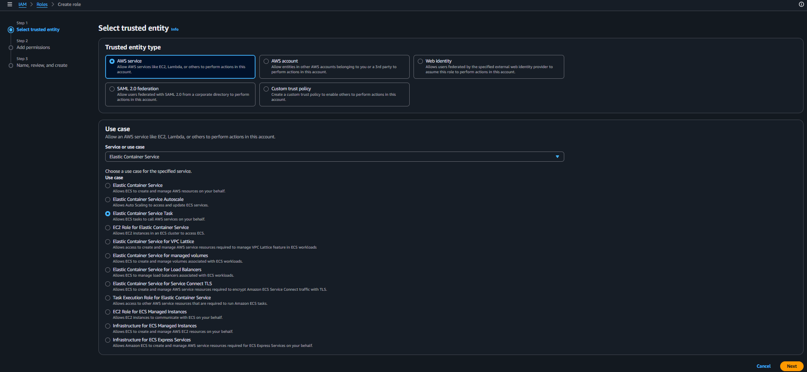
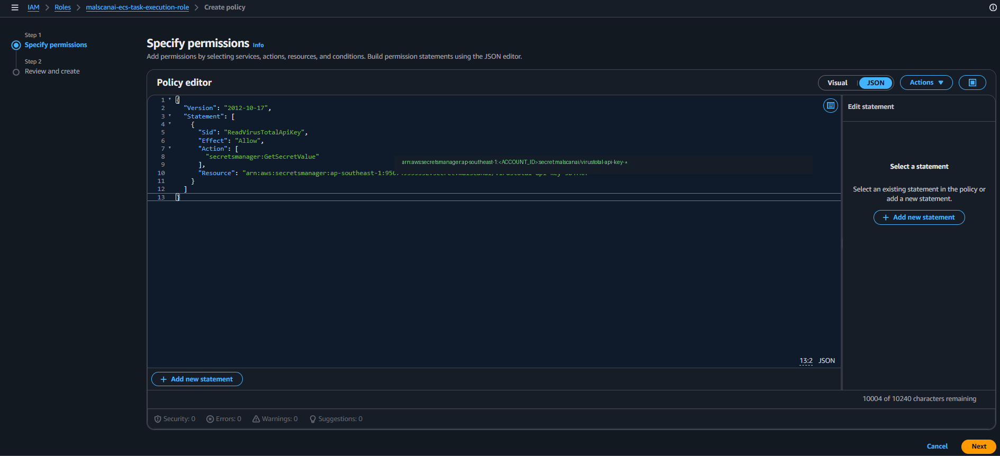
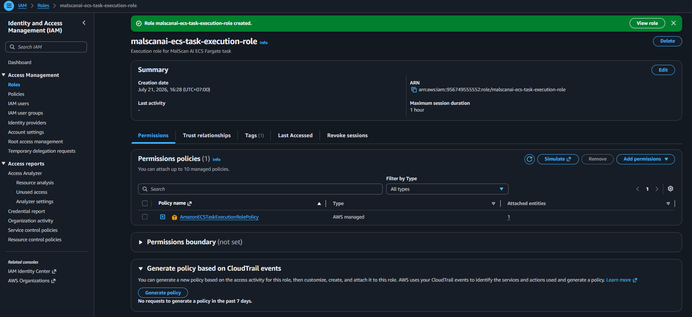
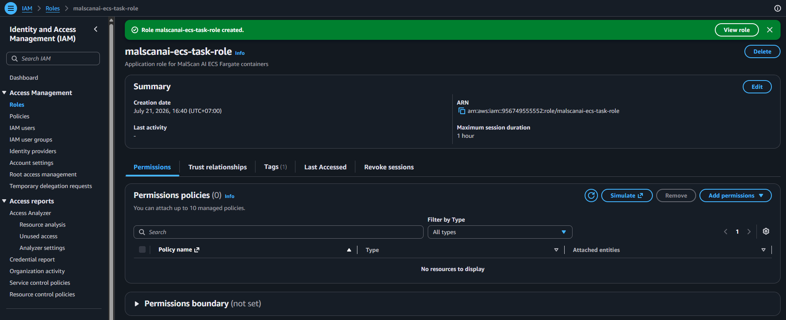
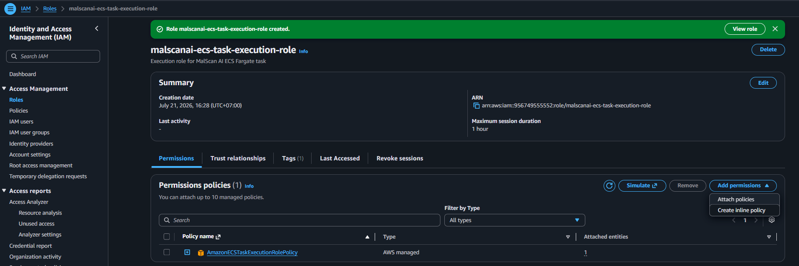

# Tách Execution Role và Task Role

Nhóm tạo hai IAM Role riêng. Execution Role được ECS agent sử dụng khi khởi động task, còn Task Role dành cho quyền mà mã nguồn trong container cần dùng.

## 1. Tạo ECS Task Execution Role

Tại **IAM → Roles**, chọn **Create role**:

- **Trusted entity type:** `AWS service`
- **Service or use case:** `Elastic Container Service`
- **Use case:** `Elastic Container Service Task`



Gắn managed policy:

```text
AmazonECSTaskExecutionRolePolicy
```

Đặt tên role:

```text
malscanai-ecs-task-execution-role
```

Policy mặc định cho phép ECS pull image từ ECR và gửi container log đến CloudWatch.

## 2. Cho Execution Role đọc VirusTotal secret

Trong role vừa tạo, chọn **Add permissions → Create inline policy** và thêm quyền:

```json
{
  "Version": "2012-10-17",
  "Statement": [
    {
      "Effect": "Allow",
      "Action": "secretsmanager:GetSecretValue",
      "Resource": "arn:aws:secretsmanager:ap-southeast-1:<ACCOUNT_ID>:secret:malscanai/virustotal-api-key-*"
    }
  ]
}
```



Nhóm giới hạn `Resource` vào đúng secret thay vì dùng `*`. ECS cần quyền này vì secret được đưa vào container tại thời điểm task khởi động.



## 3. Tạo ECS Task Role

Tạo role thứ hai với cùng trusted entity là ECS Task và đặt tên:

```text
malscanai-ecs-task-role
```



Trong phiên bản hiện tại, ứng dụng chưa gọi thêm AWS API bằng SDK nên Task Role chưa cần policy rộng. Khi bổ sung S3 hoặc dịch vụ AWS khác, quyền ứng dụng sẽ được thêm vào role này, không thêm vào Execution Role.



Cách tách hai role giúp nhóm dễ kiểm tra quyền và tránh để code trong container sử dụng quyền dành cho ECS agent.
