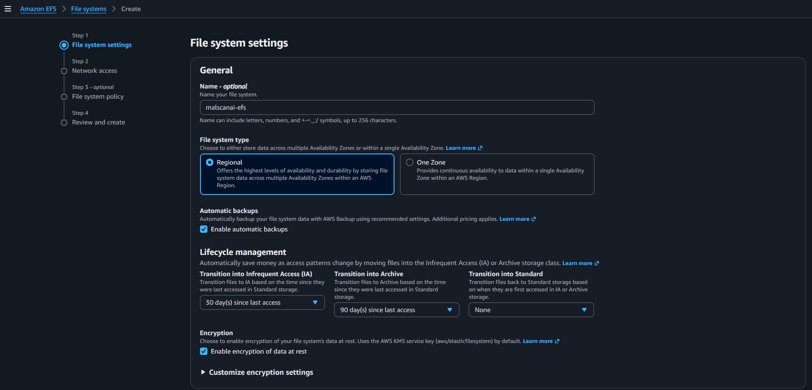
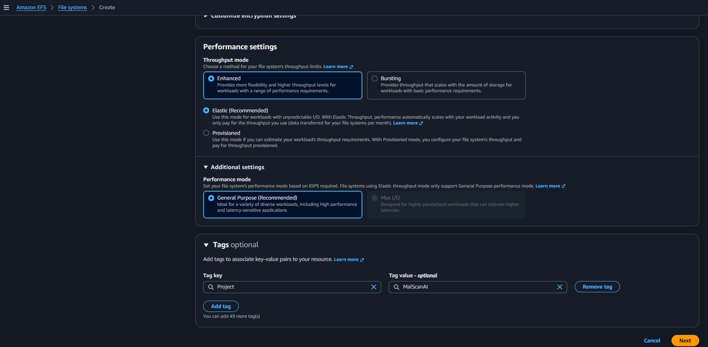
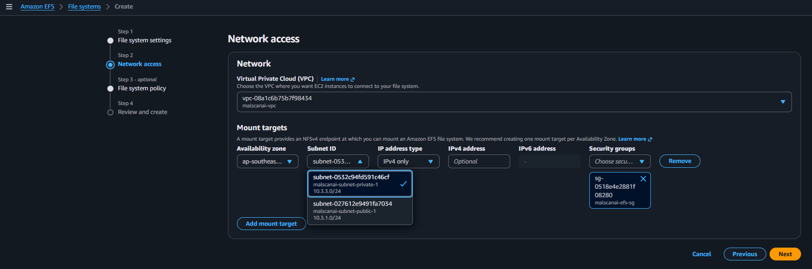
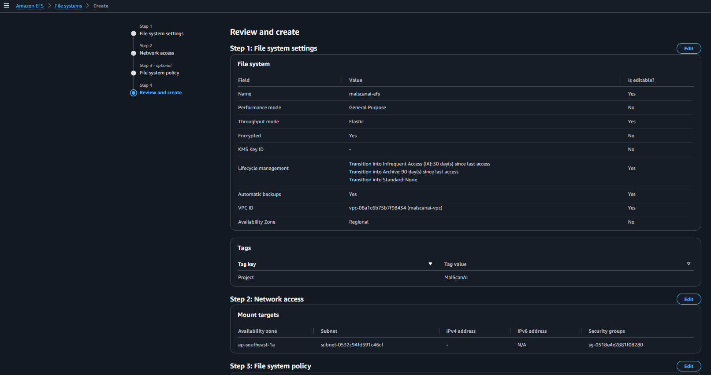
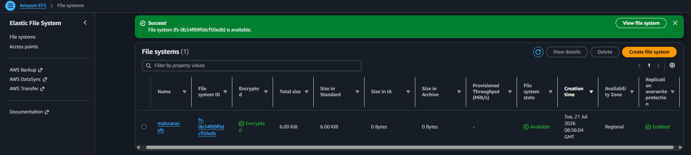
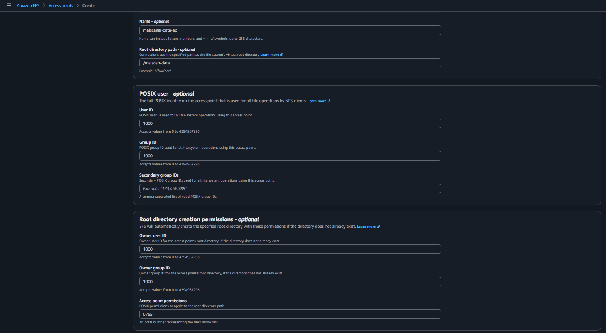
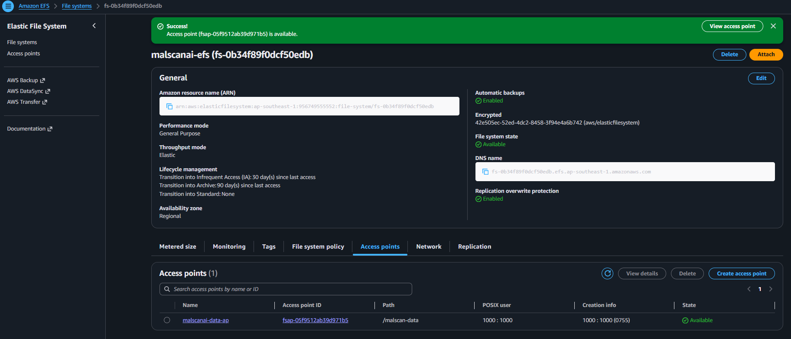

# Tạo vùng lưu trữ dùng chung cho `/app/data`

Filesystem của Fargate là tạm thời và bị mất khi task được thay thế. MalScanAI cần giữ model, dữ liệu và SQLite trong `/app/data`, vì vậy nhóm dùng Amazon EFS làm volume dùng chung.

## 1. Tạo EFS File System

Tại **Amazon EFS**, chọn **Create file system → Customize** và cấu hình:

- **Name:** `malscanai-efs`
- **File system type:** `Regional`
- **Automatic backups:** Enabled
- **Encryption at rest:** Enabled
- **Performance mode:** `General Purpose`
- **Throughput mode:** `Elastic`

Nhóm chọn Regional để EFS không phụ thuộc vào một Availability Zone. General Purpose phù hợp với truy cập file thông thường của ứng dụng, còn Elastic throughput không yêu cầu dự đoán trước thông lượng.

## 2. Cấu hình Network Access

Ở phần Network access:

- **VPC:** `malscanai-vpc`
- **Mount target:** subnet trong VPC
- **Security Group:** `malscanai-efs-sg`

Security Group EFS chỉ mở NFS `2049` từ Security Group ECS. Nhờ vậy, file system không nhận kết nối NFS từ các nguồn khác.

Kiểm tra lại cấu hình và chọn **Create**.

## 3. Tạo EFS Access Point

Trong file system vừa tạo, mở tab **Access points → Create access point**. Nhóm cấu hình root directory và POSIX user phù hợp với user chạy trong container.

Access Point giúp task luôn mount đúng thư mục và áp dụng quyền POSIX thống nhất, thay vì để mỗi container tự tạo quyền khác nhau.

Lưu lại **File system ID** và **Access point ID** để dùng trong ECS Task Definition. Trong Task Definition, volume sẽ được mount vào `/app/data`.
