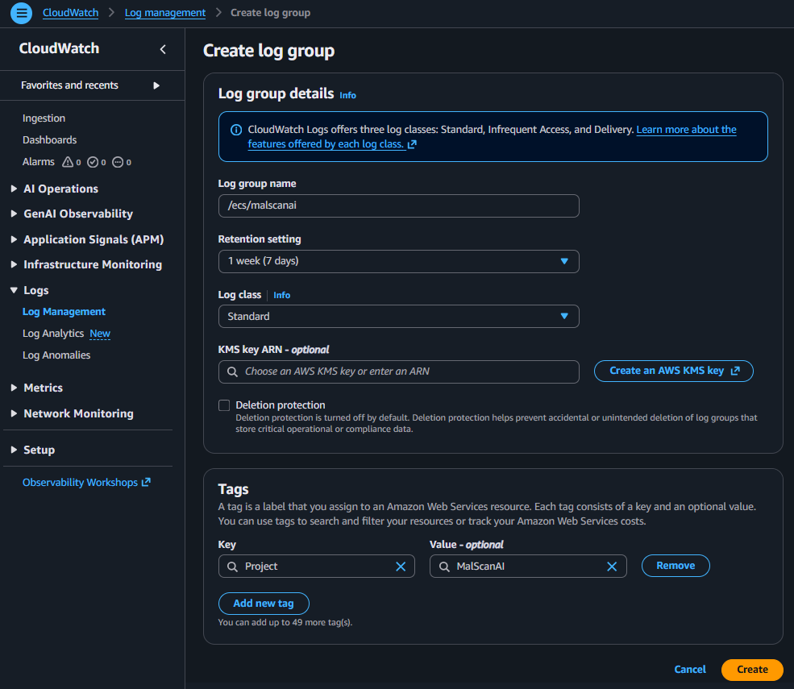
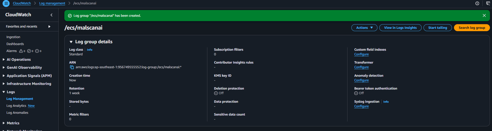
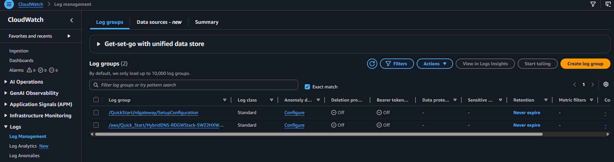

# Tạo nơi nhận log của hai container

Nhóm tạo Log Group trước Task Definition để tên log group được dùng thống nhất cho cả Streamlit và URL Engine.

## 1. Tạo Log Group

Tại **CloudWatch → Logs → Log groups**, chọn **Create log group** và nhập:

```text
/ecs/malscanai
```



Tên `/ecs/malscanai` thể hiện đây là log của ECS và gom hai container của cùng dự án vào một nhóm. Mỗi container vẫn có log stream riêng thông qua stream prefix.

Chọn **Create** và kiểm tra log group xuất hiện trong danh sách.



## 2. Kiểm tra Log Stream sau khi ECS chạy

Khi ECS Service tạo task, Streamlit và URL Engine gửi stdout/stderr lên CloudWatch thông qua `awslogs`.



Log được dùng để kiểm tra lỗi container, kết nối EFS, health check và lỗi khi gọi API bên ngoài. Nhóm không ghi API key, custom header hoặc nội dung file người dùng vào log.

{}
Đối với môi trường đồ án, có thể đặt retention từ 7 đến 30 ngày để tránh giữ log vô thời hạn và phát sinh chi phí không cần thiết.
{}
