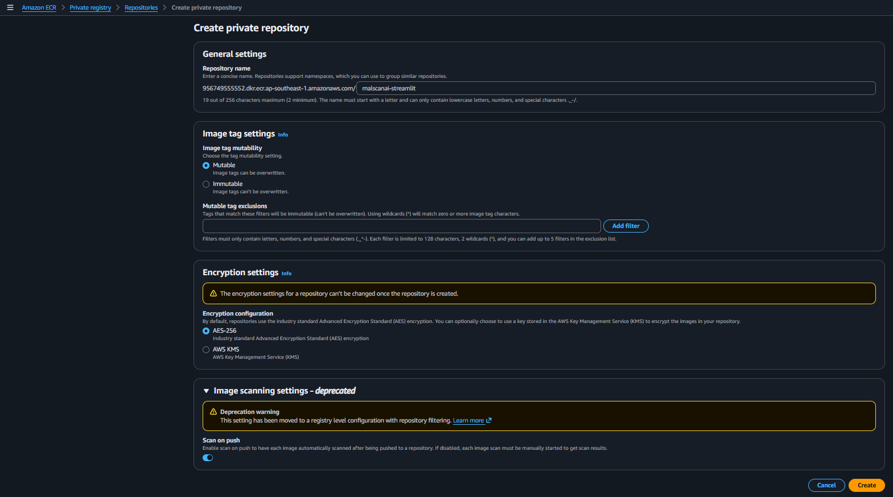
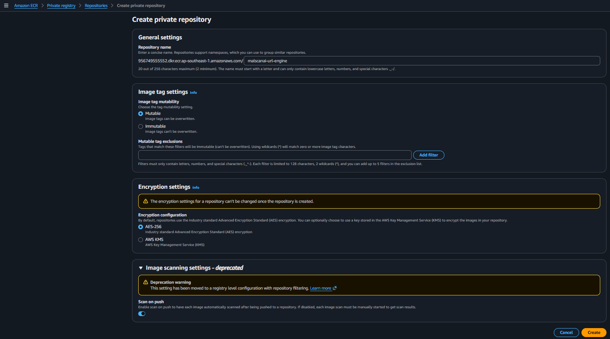
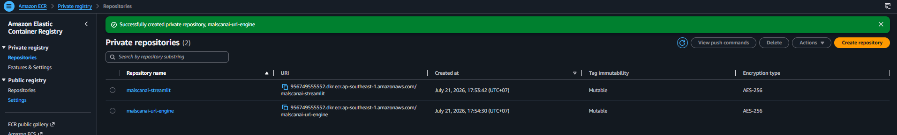
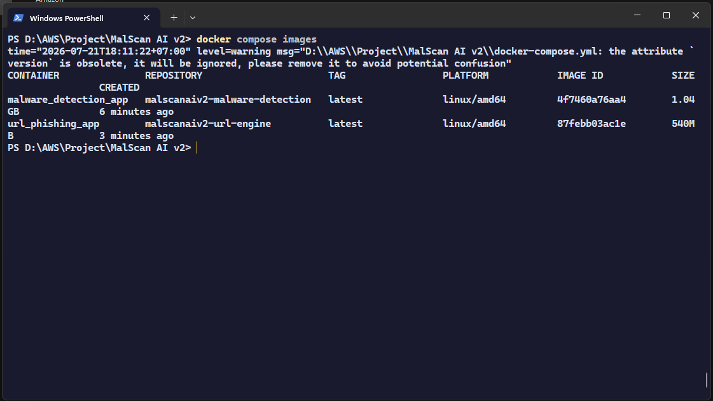
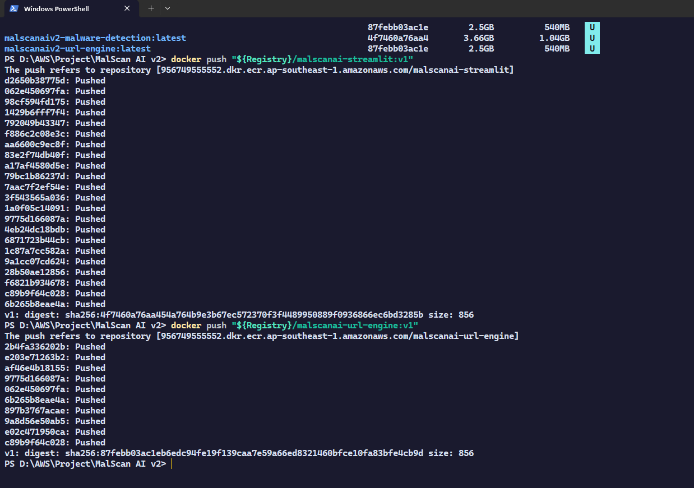
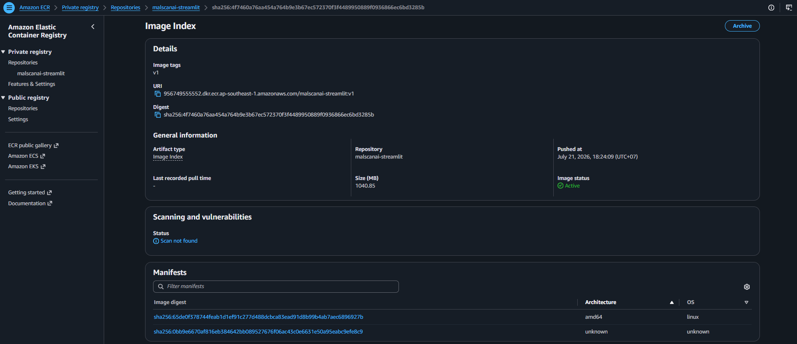
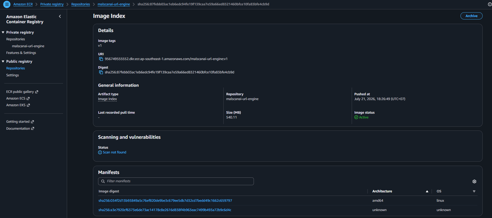

# Store both Docker images in Amazon ECR

The project has two independent containers, so the team creates two private repositories. Separate repositories give each service its own image tags and lifecycle.

## 1. Create the Streamlit repository

Go to **Amazon ECR → Private registry → Repositories**, choose **Create repository**, and configure:

- **Visibility:** `Private`
- **Repository name:** `malscanai-streamlit`
- **Image tag mutability:** keep the selected project setting
- **Scan on push:** enable when appropriate for the account



## 2. Create the URL Engine repository

Repeat the step with:

```text
malscanai-url-engine
```





## 3. Verify the local images

Before pushing, confirm that both images are available locally.



## 4. Log in to ECR, tag, and push the images

Replace `<ACCOUNT_ID>` with the AWS account ID used for deployment:

```powershell
aws ecr get-login-password --region ap-southeast-1 |
  docker login --username AWS --password-stdin <ACCOUNT_ID>.dkr.ecr.ap-southeast-1.amazonaws.com

docker tag malscanai-streamlit:latest <ACCOUNT_ID>.dkr.ecr.ap-southeast-1.amazonaws.com/malscanai-streamlit:v1
docker tag malscanai-url-engine:latest <ACCOUNT_ID>.dkr.ecr.ap-southeast-1.amazonaws.com/malscanai-url-engine:v1

docker push <ACCOUNT_ID>.dkr.ecr.ap-southeast-1.amazonaws.com/malscanai-streamlit:v1
docker push <ACCOUNT_ID>.dkr.ecr.ap-southeast-1.amazonaws.com/malscanai-url-engine:v1
```



## 5. Verify the images in ECR

Open each repository and confirm that tag `v1` is available.





The team uses version tags such as `v1`, `v2`, and `v3` instead of relying only on `latest`. A Task Definition can point to a specific version, which makes rollback easier when a deployment has a problem.
