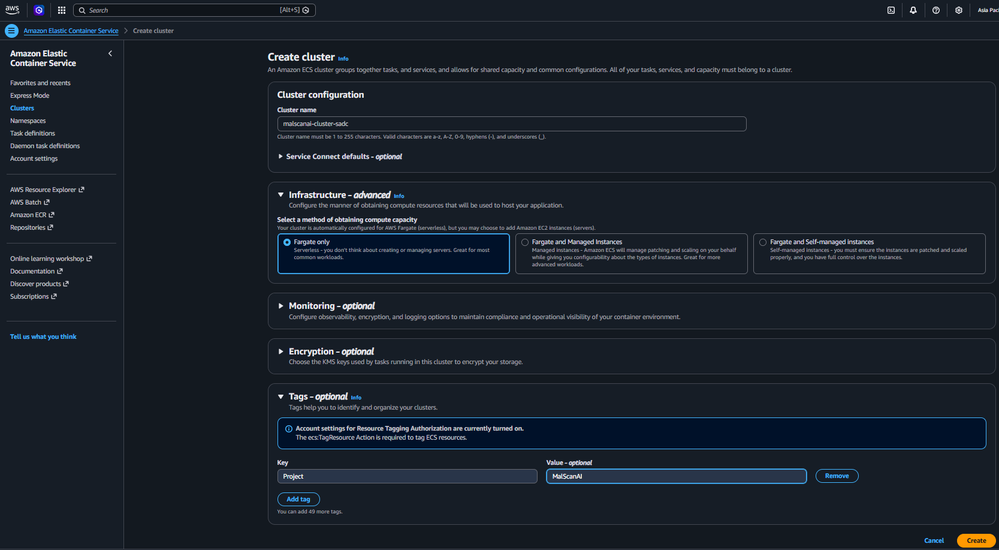
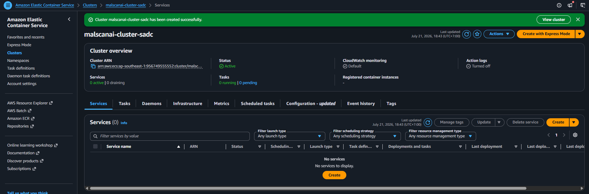

# Tạo ECS Cluster quản lý task và service

Tại **Amazon ECS → Clusters**, chọn **Create cluster** và cấu hình:

- **Cluster name:** `malscanai-cluster`
- **Infrastructure:** `AWS Fargate (serverless)`
- **Container Insights:** bật khi cần theo dõi chi tiết CPU, memory và task

Nhóm chọn Fargate vì không phải tạo, vá lỗi hoặc quản lý EC2 container instance. Với phạm vi đồ án, nhóm tập trung vào container, task definition và network thay vì quản trị máy chủ nền.

Chọn **Create**, sau đó kiểm tra cluster xuất hiện và chưa có service hoặc task.

Cluster là vùng quản lý logic của ECS. Tài nguyên CPU và memory chỉ được cấp khi service chạy Fargate task.
