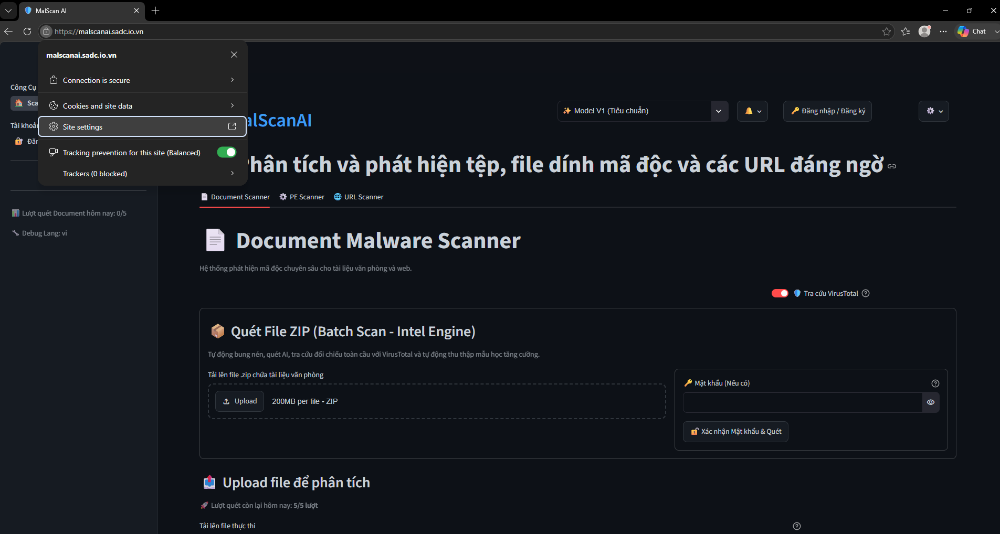
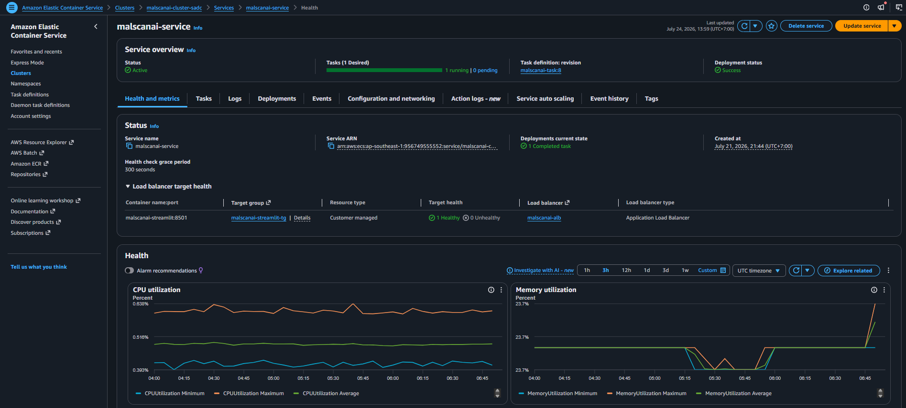
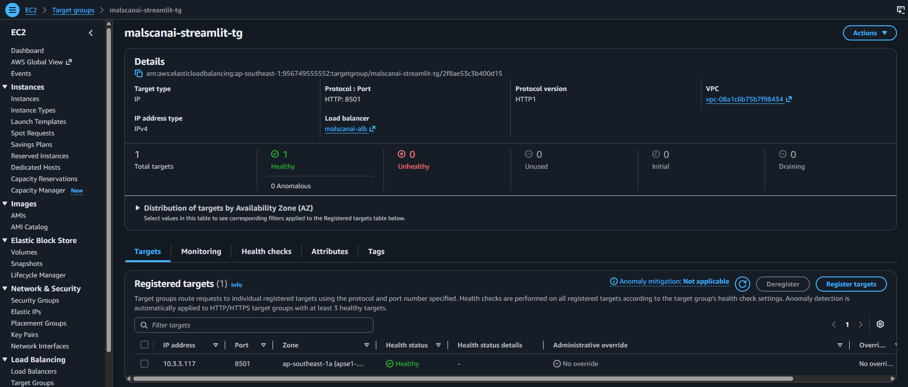
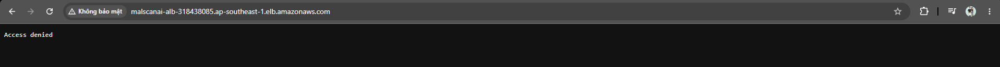

# Kiểm thử end-to-end sau triển khai

Sau khi ECS Service hoàn tất deployment, nhóm kiểm tra cả đường truy cập từ Internet và trạng thái các thành phần phía sau Load Balancer. Phần demo chức năng đã được quay thành video, vì vậy chương này tập trung vào các bằng chứng kỹ thuật trên AWS.

## 1. Truy cập ứng dụng bằng HTTPS

Người dùng truy cập ứng dụng tại tên miền `https://malscanai.sadc.io.vn`. Trình duyệt xác nhận kết nối được bảo vệ bằng HTTPS và giao diện Streamlit tải thành công.

## 2. Kiểm tra ECS Service

ECS Service ở trạng thái `Active`, có một task mong muốn, một task đang chạy, không có task pending và deployment hiện tại hoàn tất thành công.

## 3. Kiểm tra Target Group

Target Group sử dụng target type `IP`, giao thức HTTP và port `8501`. Tại thời điểm kiểm thử, target đạt trạng thái `Healthy` và không có target `Unhealthy`.

## 4. Kiểm tra chặn truy cập trực tiếp ALB

Khi truy cập trực tiếp DNS name của Application Load Balancer bằng HTTP, ALB trả về `Access denied`. Kết quả này xác nhận listener rule chỉ forward request có custom header do CloudFront gửi đến; request trực tiếp đi vào default action và nhận phản hồi `403`.

## 5. Bảng kết quả kiểm thử

| Bài kiểm thử | Kết quả mong đợi | Kết quả thực tế |
|---|---|---|
| Truy cập tên miền HTTPS | Giao diện MalScanAI tải thành công | Đạt |
| ECS Service | `1 Running`, `0 Pending`, deployment thành công | Đạt |
| Target Group | `1 Healthy`, `0 Unhealthy` | Đạt |
| Truy cập trực tiếp ALB | Bị từ chối bằng phản hồi `403` | Đạt |
| Chức năng quét | URL, PE và tài liệu trả kết quả | Được trình bày trong video demo |
| Log ứng dụng | Hai container gửi log lên CloudWatch | Đạt, xem chương 5.6 |

{}
Ảnh kiểm thử chỉ sử dụng file và URL mẫu an toàn. Không đưa API key, mật khẩu, custom-header value hoặc dữ liệu cá nhân vào ảnh workshop.
{}
