# Theo dõi hoạt động của MalScanAI

Nhóm sử dụng Amazon CloudWatch để tập trung log của hai container, xem metric mặc định của ECS và ALB, đồng thời tạo alarm theo dõi tình trạng Target Group.

## 1. ECS CPU và Memory

Tab **Health and metrics** của ECS Service cho phép theo dõi `CPUUtilization` và `MemoryUtilization`. Ảnh đo cho thấy CPU ở mức thấp trong phần lớn thời gian và bộ nhớ sử dụng khoảng 23,7% tại thời điểm kiểm tra. Điều này cho thấy cấu hình 2 vCPU và 4 GB RAM còn dư tài nguyên đối với tải demo hiện tại.

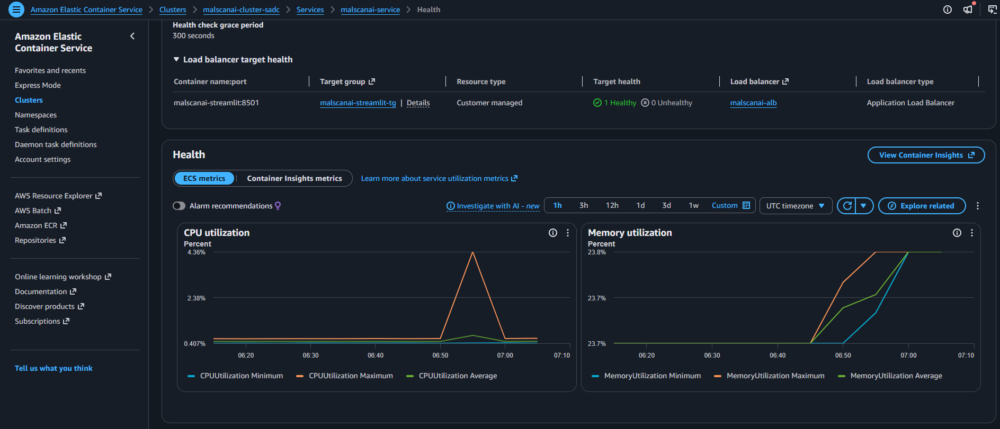

## 2. ALB Metrics

Application Load Balancer cung cấp các metric như số request, response time, HTTP status code và target health. Nhóm dùng các biểu đồ này để xác nhận ALB tiếp nhận traffic và chuyển request đến target.

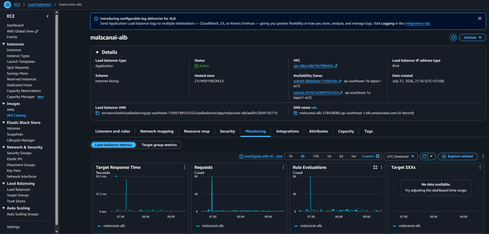

Các metric cần theo dõi khi vận hành gồm:

- `RequestCount`
- `TargetResponseTime`
- `HTTPCode_Target_5XX_Count`
- `HealthyHostCount`
- `UnHealthyHostCount`

## 3. Log của Streamlit

Container Streamlit ghi lại tiến trình nhận file, giải nén ZIP, kiểm tra mẫu và thực hiện phân tích. Log stream riêng giúp nhóm tìm lỗi theo từng task mà không truy cập trực tiếp vào container.

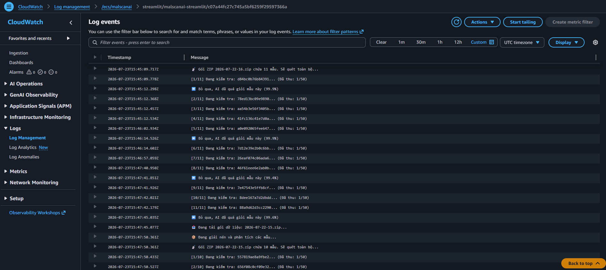

## 4. Log của URL Engine

Log của URL Engine xác nhận mô hình AI được nạp và Flask service lắng nghe nội bộ tại port `5000`. Streamlit gọi service này trong cùng task thông qua `127.0.0.1:5000`.

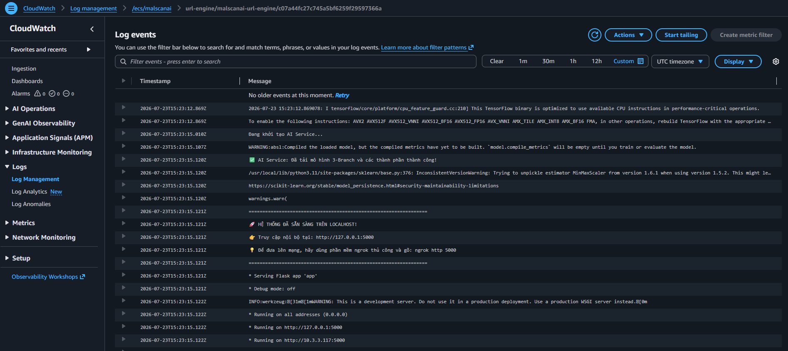

Log hiện có cảnh báo về phiên bản thư viện khi nạp mô hình và cảnh báo Flask development server. Nhóm ghi nhận đây là giới hạn cần xử lý trong phiên bản tiếp theo bằng cách đồng bộ phiên bản thư viện và sử dụng production WSGI server.

## 5. Tạo CloudWatch Alarm cho Target Group

Alarm sử dụng metric `UnHealthyHostCount` của đúng cặp Application Load Balancer và Target Group.

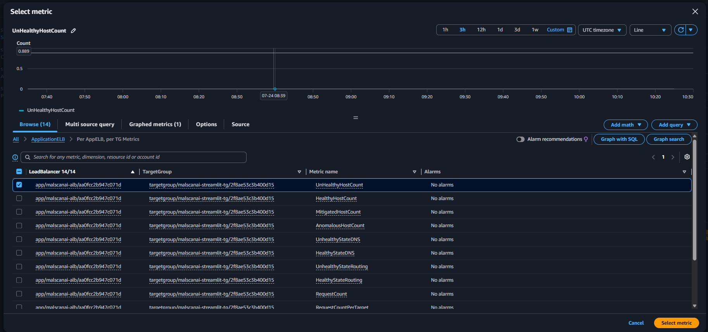

Thông số được sử dụng:

```text
Metric: UnHealthyHostCount
Statistic: Minimum
Period: 1 minute
Threshold type: Static
Condition: Greater than or equal to 1
Datapoints to alarm: 2 out of 2
Missing data: Treat missing data as good
```

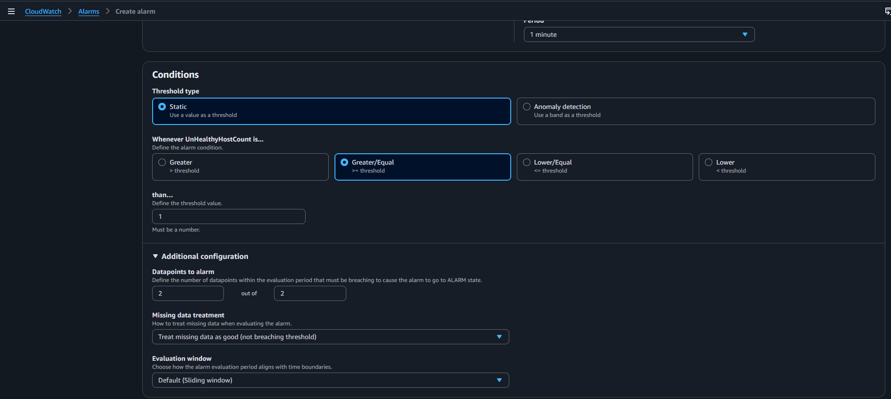

CloudWatch Alarm không sử dụng SNS action trong bước tạo. Alarm vẫn lưu trạng thái và lịch sử trên CloudWatch.

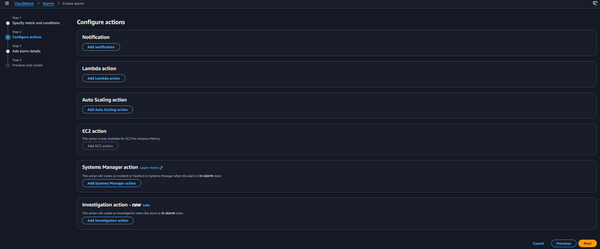

Alarm được đặt tên `malscanai-unhealthy-target-alarm`. Ngay sau khi tạo, trạng thái có thể là `Insufficient data` trong thời gian CloudWatch chờ đủ datapoint đánh giá.

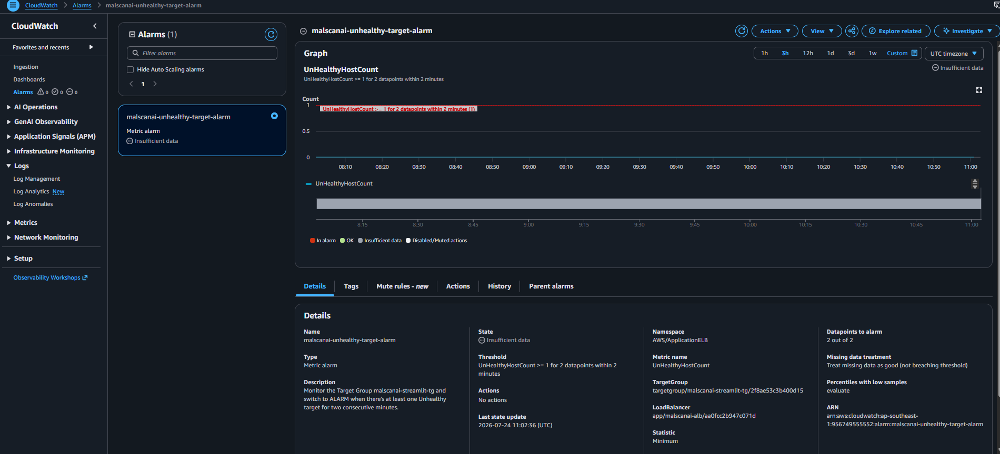

## 6. Gửi sự kiện cảnh báo qua AWS User Notifications

Để không cần thêm Amazon SNS vào kiến trúc, nhóm tạo một AWS User Notifications configuration theo sự kiện **CloudWatch Alarm State Change**. Event rule chỉ nhận sự kiện của alarm MalScanAI khi trạng thái mới là `ALARM`.

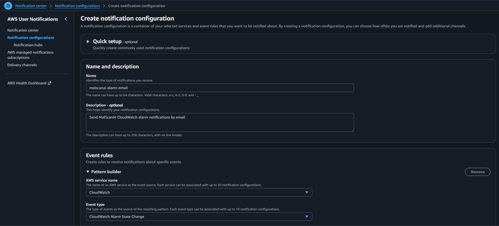

Bộ lọc nâng cao giới hạn sự kiện theo tên alarm và trạng thái:

```json
{
  "detail": {
    "alarmName": ["malscanai-unhealthy-target-alarm"],
    "state": {
      "value": ["ALARM"]
    }
  }
}
```

Email được thêm làm delivery channel và phải được xác minh trước khi nhận thông báo.

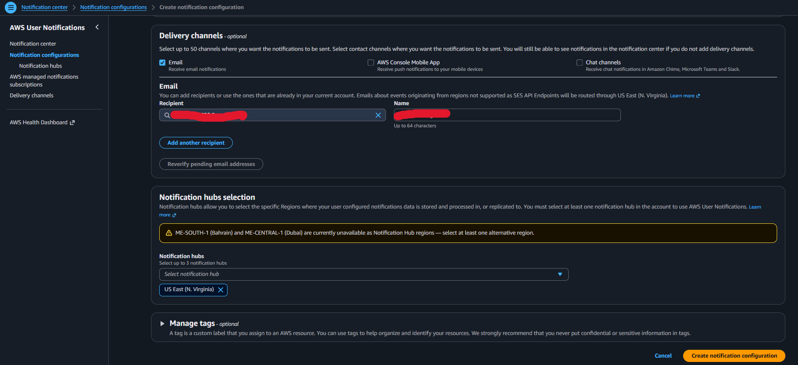

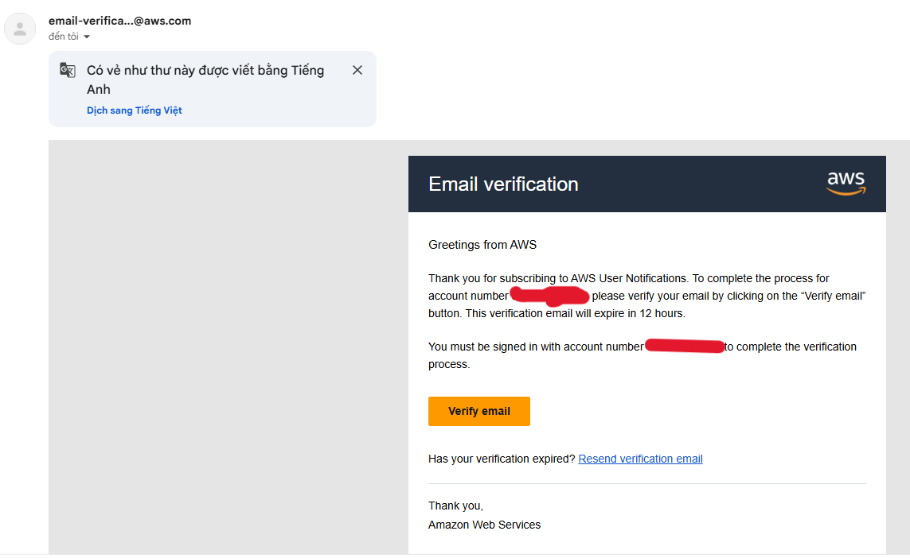

Sau khi hoàn tất, notification configuration và email channel ở trạng thái `Active`.

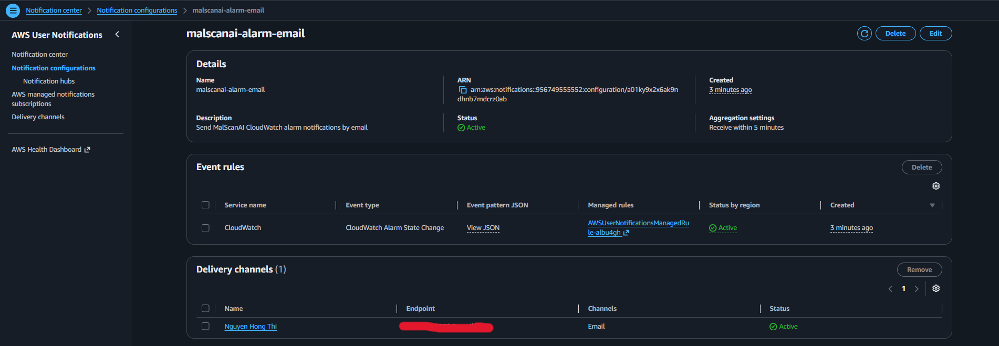

{}
CloudWatch Alarm gửi sự kiện trạng thái, không tự tạo báo cáo PDF. Báo cáo định kỳ có biểu đồ và file đính kèm cần thêm một workflow riêng, ví dụ EventBridge, Lambda và Amazon SES.
{}
