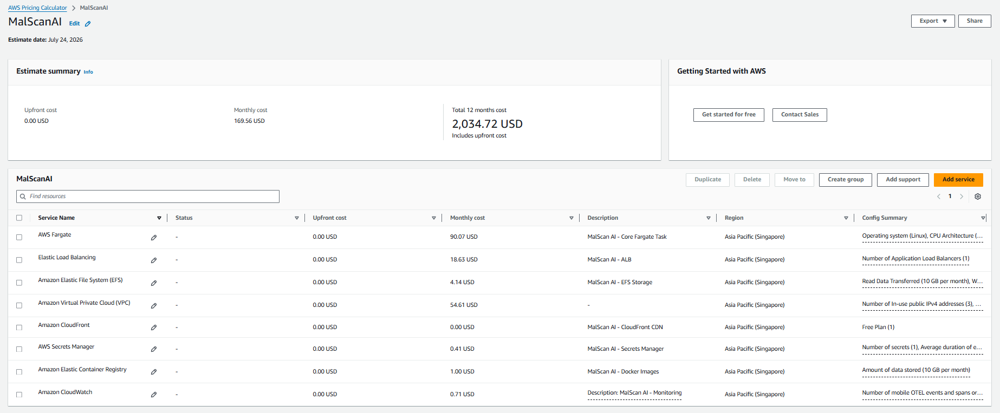

# Ước tính chi phí vận hành theo tháng

Nhóm sử dụng AWS Pricing Calculator để ước tính chi phí khi MalScanAI hoạt động liên tục trong một tháng tại Region **Asia Pacific (Singapore)**. Kết quả không bao gồm thuế, credit, Free Tier theo tài khoản hoặc thay đổi lưu lượng thực tế.

## 1. Giả định tính toán

| Thành phần | Giả định |
|---|---|
| Thời gian hoạt động | 730 giờ/tháng |
| ECS Fargate | 1 task, Linux x86, 2 vCPU, 4 GB RAM, 21 GB ephemeral storage |
| Application Load Balancer | 1 ALB |
| Amazon VPC | 1 NAT Gateway, 10 GB data processed/tháng, 3 public IPv4 |
| Amazon EFS | Regional Standard, 10 GB lưu trữ, 10 GB đọc và 2 GB ghi/tháng |
| Amazon ECR | 10 GB image/tháng |
| CloudWatch | Log ứng dụng, metric và một alarm |
| Secrets Manager | 1 secret trong 30 ngày |
| CloudFront | Free Flat-Rate Plan, quantity 1 |

## 2. Kết quả ước tính

| Dịch vụ | Chi phí hiển thị mỗi tháng |
|---|---:|
| AWS Fargate | 90,07 USD |
| Amazon VPC | 54,61 USD |
| Elastic Load Balancing | 18,63 USD |
| Amazon EFS | 4,14 USD |
| Amazon ECR | 1,00 USD |
| Amazon CloudWatch | 0,71 USD |
| AWS Secrets Manager | 0,41 USD |
| Amazon CloudFront | 0,00 USD |
| **Tổng theo Calculator** | **169,56 USD/tháng** |
| **Ước tính 12 tháng** | **2.034,72 USD** |

Các số thành phần được làm tròn theo giao diện Calculator nên tổng khi cộng thủ công có thể lệch vài cent so với tổng hệ thống hiển thị.

## 3. Nhận xét

Ba thành phần Fargate, VPC và ALB chiếm khoảng 96% tổng chi phí. Các tài nguyên này phát sinh phí theo thời gian hoạt động ngay cả khi website có ít request. Kiến trúc hiện tại ưu tiên cách ly mạng, HTTPS, health check và vận hành ổn định hơn mức chi phí tối thiểu cho một website demo.

## 4. Biện pháp tối ưu đang áp dụng

- Chỉ chạy một ECS task và ứng dụng hiện dùng SQLite trên EFS.
- Dùng CloudFront Free Flat-Rate Plan cho distribution của workshop.
- Đặt CloudWatch Logs retention ngắn, đề xuất 7 ngày cho môi trường demo.
- Chỉ lưu một secret cần thiết trong Secrets Manager.
- Không thêm AWS WAF pay-as-you-go riêng vì WAF nằm trong CloudFront plan.
- Giữ tổng dung lượng ECR nhỏ và chỉ giữ các image cần rollback.

## 5. Hướng tối ưu tiếp theo

- Giảm CPU và RAM Fargate sau khi đo tải thực tế, nhưng phải chạy lại đầy đủ bài kiểm thử.
- Tạo ECR Lifecycle Policy để chỉ giữ một số phiên bản gần nhất.
- Xóa NAT Gateway, ALB và ECS Service ngay khi kết thúc môi trường demo.
- Theo dõi Billing và Cost Explorer để phát hiện tài nguyên còn chạy ngoài kế hoạch.
- Với môi trường chỉ hoạt động theo lịch, có thể đặt lịch giảm desired count về `0`; tuy nhiên website sẽ không phục vụ trong thời gian task dừng.
- Khi thiết kế phiên bản mới, đánh giá phương án không phụ thuộc NAT Gateway hoặc sử dụng kiến trúc event-driven phù hợp hơn với lưu lượng thấp.

{}
AWS Pricing Calculator chỉ là ước tính. Chi phí thực tế phụ thuộc số request, dung lượng file, dữ liệu qua NAT Gateway, log, thuế và chính sách giá tại thời điểm sử dụng.
{}
