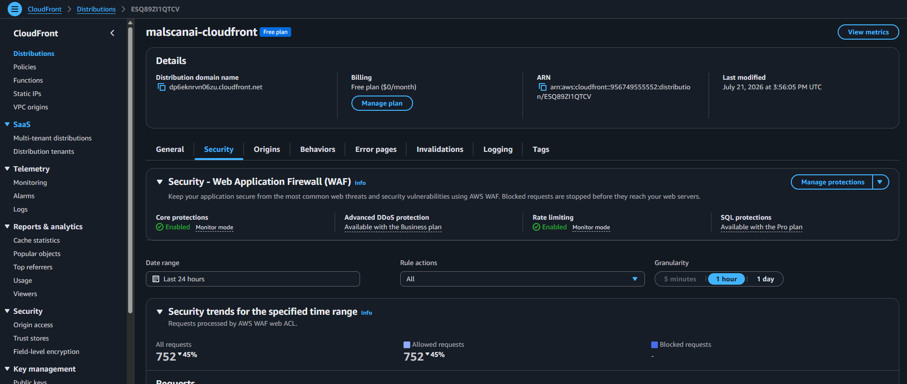

# Tổng hợp các lớp bảo vệ

Các biện pháp bảo mật được cấu hình rải rác trong quá trình triển khai. Chương này tổng hợp lại trạng thái cuối cùng và các giới hạn cần trình bày trung thực.

## 1. Các biện pháp đã triển khai

| Lớp | Cấu hình thực tế |
|---|---|
| DNS và TLS | Route 53 trỏ tên miền đến CloudFront; người dùng truy cập bằng HTTPS |
| Edge | CloudFront Free Plan đứng trước ALB |
| AWS WAF | Core protections và rate limiting đang được bật ở Monitor mode |
| Origin protection | CloudFront gửi custom origin header; ALB default action trả `403` |
| ECS networking | Task chạy trong private subnet và không có public IP |
| Security Group | Port 8501 chỉ nhận traffic từ ALB Security Group |
| URL Engine | Port 5000 không được public; Streamlit gọi qua `127.0.0.1` |
| EFS | NFS port 2049 chỉ nhận từ ECS Security Group |
| Secrets | VirusTotal API key nằm trong Secrets Manager, không hard-code trong image |
| IAM | Tách ECS Task Execution Role và Task Role |
| Logging | Hai container gửi stdout/stderr vào `/ecs/malscanai` |

## 2. WAF Monitor mode

CloudFront Security cho thấy Core protections và Rate limiting đang được bật ở **Monitor mode**. Cấu hình này ghi nhận request và xu hướng bảo mật nhưng không block request theo các rule đang monitor.

Nhóm chọn Monitor mode vì managed rule từng chặn nhầm request upload của Streamlit. Đây là lựa chọn để giữ chức năng upload hoạt động trong phạm vi workshop, không phải trạng thái bảo vệ tối đa.

## 3. Xác thực bảo vệ ALB

Truy cập trực tiếp ALB nhận `403`, trong khi truy cập qua domain CloudFront bằng HTTPS vẫn hoạt động. Kết quả này chứng minh lớp custom header và default fixed response đang hoạt động đúng.

## 4. Giới hạn hiện tại

### Một ECS task và SQLite

Hệ thống giữ `desired count = 1` và database SQLite nằm trên EFS. Nhiều task cùng ghi vào một file SQLite có thể gây tranh chấp khóa. Vì vậy phiên bản này chưa bật ECS Service Auto Scaling hoặc horizontal scaling.

### WAF chưa block ở production mode

Monitor mode chỉ quan sát. Trước khi dùng cho production, cần kiểm tra WAF logs, tạo ngoại lệ chính xác cho endpoint upload và chuyển các rule phù hợp sang Block mode.

### URL Engine dùng Flask development server

CloudWatch log cho thấy URL Engine đang dùng Flask development server và có cảnh báo phiên bản thư viện khi nạp model. Phiên bản tiếp theo nên dùng Gunicorn hoặc production WSGI server, đồng thời cố định và đồng bộ phiên bản thư viện huấn luyện với môi trường inference.

### Khả năng sẵn sàng cao chưa hoàn chỉnh

ALB và CloudFront hỗ trợ lớp truy cập, nhưng ứng dụng chỉ có một task và một database SQLite. Nếu task bị thay thế, ECS có thể khởi động task mới; tuy nhiên trong thời gian thay thế có thể xuất hiện khoảng gián đoạn ngắn.

## 5. Hướng cải thiện

- Chuyển SQLite sang Amazon RDS hoặc DynamoDB trước khi tăng số lượng task.
- Dùng ít nhất hai task ở nhiều Availability Zone sau khi lớp dữ liệu hỗ trợ scale-out.
- Triển khai WAF exception cụ thể cho Streamlit upload thay vì để toàn bộ rule ở Monitor mode.
- Dùng production WSGI server và loại bỏ cảnh báo phiên bản model.
- Bổ sung backup định kỳ cho dữ liệu EFS.
- Kiểm tra định kỳ IAM policy và thu hẹp quyền theo principle of least privilege.
